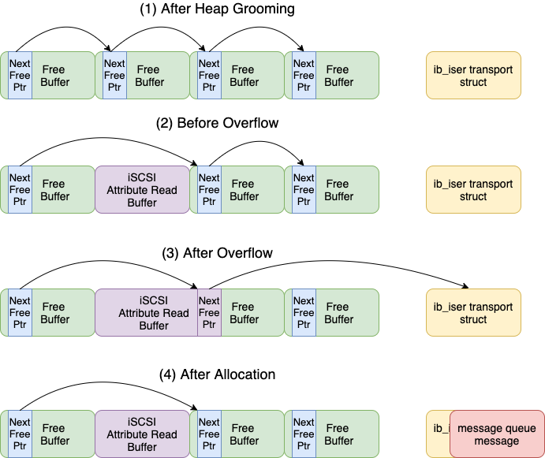
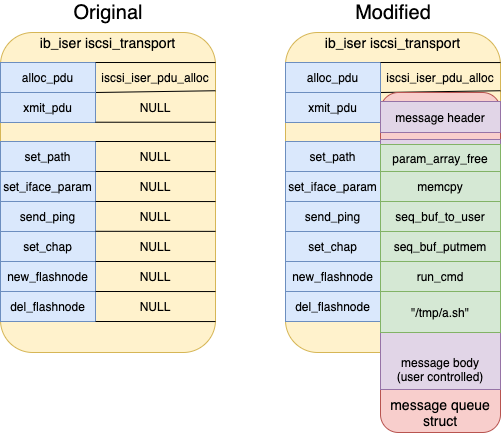

# Overview

The following report discloses three distinct vulnerabilities discovered
by GRIMM while researching the Linux kernel. The first vulnerability is
a heap buffer overflow, the second is a kernel pointer leak, and the
third is an out-of-bounds kernel memory read. All three vulnerabilities
are associated with the iSCSI subsystem.

When combined, the first two vulnerabilities can be used to as a Local
Privilege Escalation (LPE), which allows a normal user to gain root
privileges. These vulnerabilities affect many Linux-based systems with
or without iSCSI hardware present, as well as other Linux installations
in which RDMA hardware is available. See the “Impact” section for
additional details.

# Bug Identification

## Linux Kernel Heap Buffer Overflow

-   Vulnerability Type: Heap Buffer Overflow

-   Location: iscsi_host_get_param() in `drivers/scsi/libiscsi.c`

-   Affected Versions: Tested on RHEL 8.1, 8.2, and 8.3

-   Impact: LPE, Information Leak, Denial of Service (DoS)

-   CVE Number: CVE-2021-27365

The first vulnerability is a heap buffer overflow in the iSCSI
subsystem. The vulnerability is triggered by setting an iSCSI string
attribute to a value larger than one page, and then trying to read it.
Internally, a sprintf call (line 3397 in `drivers/scsi/libiscsi.c` in
the kernel-4.18.0-240.el8 source code) is used on the user-supplied
value with a buffer of a single page that is used for the seq file that
backs the iscsi attribute. More specifically, an unprivileged user can
send netlink messages to the iSCSI subsystem (in
`drivers/scsi/scsi_transport_iscsi.c`) which sets attributes related to
the iSCSI connection, such as hostname, username, etc, via the helper
functions in `drivers/scsi/libiscsi.c`. These attributes are only
limited in size by the maximum length of a netlink message (either
2\*\*32 or 2\*\*16 depending on the specific code processing the
message). The sysfs and seqfs subsystem can then be used to read these
attributes, however it will only allocate a buffer of PAGE_SIZE
(single_open in `fs/seq_file.c`, called when the sysfs file is opened).
This bug was first introduced in 2006 (see `drivers/scsi/libiscsi.c`,
commits a54a52caad and fd7255f51a) when the iSCSI subsystem was being
developed. However, the kstrdup/sprintf pattern used in the bug has been
expanded to cover a larger number of fields since the initial commit.

## Linux Kernel Pointer Leak to Userspace

-   Vulnerability Type: Kernel Pointer Leak

-   Location: show_transport_handle() in
    drivers/scsi/scsi_transport_iscsi.c

-   Affected Versions: Tested on RHEL 8.1, 8.2, and 8.3

-   Impact: Information Leak

-   CVE Number: CVE-2021-27363

In addition to the heap overflow vulnerability, GRIMM discovered a
kernel pointer leak that can be used to determine the address of the
iscsi_transport structure. When an iSCSI transport is registered with
the iSCSI subsystem, the transport’s ”handle“ is available to
unprivileged users via the sysfs file system, at
`/sys/class/iscsi_transport/$TRANSPORT_NAME/handle`. When read, the
show_transport_handle function (in
`drivers/scsi/scsi_transport_iscsi.c`) is called, which leaks the
handle. This handle is actually the pointer to an iscsi_transport struct
in the kernel module’s global variables.

## Linux Kernel Out-of-Bounds Read

-   Vulnerability Type: Out-of-Bounds Read

-   Location: iscsi_if_recv_msg() in drivers/scsi/scsi_transport_iscsi.c

-   Affected Versions: Tested on RHEL 8.1, 8.2, and 8.3

-   Impact: Information Leak, DoS

-   CVE Number: CVE-2021-27364

The final vulnerability is an out-of-bounds kernel read in the libiscsi
module (`drivers/scsi/libiscsi.c`). This bug is triggered via a call to
send_pdu (lines 3747-3750 in `drivers/scsi/scsi_transport_iscsi.c` in
the kernel-4.18.0-240.el8 source code). Similar to the first
vulnerability, an unprivileged user can craft netlink messages that
specify buffer sizes that the driver fails to validate, causing a
controllable out-of-bounds read. There are multiple user-controlled
values that are not validated, including the calculation of the size of
the preceding header, allowing for a read of up to 8192 bytes at a
controllable 32-bit offset from the original heap buffer.

# Technical Analysis

## Exploit

GRIMM developed a Proof of Concept (PoC) exploit that demonstrates the
use of the first two vulnerabilities.

In its current state, the PoC has support for the
`4.18.0-147.8.1.el8_1.x86_64`, `4.18.0-193.14.3.el8_2.x86_64`, and
`4.18.0-240.el8.x86_64` releases of the Linux kernel. Other versions of
the Linux kernel are also vulnerable, but symbol addresses and structure
offsets will need to be gathered before they can be exploited. See the
`symbols.c`, `symbols.h`, and `utilities/get_symbols.sh` script for a
semi-automated symbol gathering approach. Testing was performed against
RHEL 8.1 through 8.3, but other Linux distributions using the same
underlying kernel images are vulnerable as well.

### KASLR Leak

Before we can start modifying kernel structures and changing function
pointers, we’ve got to bypass KASLR. Linux randomizes the base address
of the kernel to hinder the exploitation process. However, due to
numerous sources of local information leak, KASLR can often be bypassed
by a local user
(<https://forums.grsecurity.net/viewtopic.php?f=7&t=3367>). This exploit
is no exception, as it includes two separate information leaks which
enable it to bypass KASLR.

The first information leak comes from a non-null terminated heap buffer.
When an iSCSI string attribute is set via the `iscsi_switch_str_param`
function (shown below), the `kstrdup` function is called on the user
provided input (in `new_val_buf`). However, the buffer containing the
user input is not initialized upon allocation, and the kernel does not
enforce that the user’s input is NULL terminated. As a result, the
`kstrdup` function will copy any non-NULL bytes after the client input,
which can later be retrieved by reading back the attribute. The exploit
abuses this information leak by specifying a string of 656 bytes, which
results in the address of the `netlink_sock_destruct` being included in
the `kstrdup`’ed string. Later, the exploit reads back the attribute set
here, and obtains the address of this function. By then subtracting off
the base address of the `netlink_sock_destruct`, the exploit can
calculate the kernel slide. The allocation which sets the
`netlink_sock_destruct` function pointer is performed in the
`__netlink_create` function (`net/netlink/af_netlink.c`) as a natural
side effect of sending a netlink message.

``` objectivec
int iscsi_switch_str_param(char **param, char *new_val_buf)
{
  char *new_val;

  if (*param) {
    if (!strcmp(*param, new_val_buf))
      return 0;
  }

  new_val = kstrdup(new_val_buf, GFP_NOIO);
  if (!new_val)
    return -ENOMEM;

  kfree(*param);
  *param = new_val;
  return 0;
}
```

The second information leak obtains the address of the target module’s
`iscsi_transport` structure via the second vulnerability. This structure
defines the transport’s operations, i.e. how it handles each of the
various iSCSI requests. As this structure is within the target kernel
module’s global region, we can use this information leak to obtain the
address of its kernel module (and thus any other variables within it).

### Obtaining a Kernel Write Primitive

The Linux kernel heap’s SLUB allocator maintains a cache of objects of
the same size (in powers of 2). Each free object in this cache contains
a pointer to the next free item in the cache (at offset 0 in the free
item). The exploit uses the heap overflow to modify the freelist pointer
at the beginning of the adjacent slab. By redirecting this pointer, we
can choose where the kernel will make an allocation. By carefully
choosing the allocation location and controlling the allocations in this
cache, the exploit obtains a limited kernel write primitive. As
explained in the next section, the exploit uses this controlled write to
modify the iscsi_transport struct.

In order to obtain the desired heap layout, the exploit utilizes heap
grooming via POSIX message queue messages
(<https://man7.org/linux/man-pages/man7/mq_overview.7.html>). The
exploit operates on the 4096 kmalloc cache, which is a comparatively
low-traffic cache. As such, abusing the freelist to redirect it to an
arbitrary location is unlikely to cause issues. Message queue messages
were selected as the ideal heap grooming allocation as they can be
easily allocated/freed from userland, and their contents and size can be
mostly controlled from userland.

The exploit takes the following steps to obtain a kernel write primitive
from the heap overflow:

1.  Send a large number of message queue messages to ourselves, but do
    not receive them. This will cause the kernel to create the
    associated message queue structures in the kernel, flooding the 4096
    kmalloc cache.

2.  Receive a number of the message queue messages. This will cause the
    kernel to free the kernel message queue structures. If successful,
    the resulting 4096 kmalloc cache will contain a number of free items
    in a row, such as shown in the image (1) below.

3.  The exploit triggers the overflow. The overflow allocation will take
    one of the cache’s free entries and overflow the next freelist
    pointer for the adjacent free item, as shown in (2) and (3) in the
    image below. The exploit uses the overflow to redirect the next
    freelist pointer to point at the `ib_iser` module’s
    `iscsi_transport` struct.

4.  After the overflow, the exploit sends more message queue messages in
    order to reallocate the modified free item. The kernel will traverse
    the freelist and return an allocation at our modified freelist
    pointer, as shown in (4) in the image below.

<figure>
<figcaption aria-hidden="true">Heap Grooming and Overflow Cache Layout</figcaption>
</figure>

While this approach does allow the exploit to write to kernel memory at
a controlled location, it does have a few caveats. The selected location
must start with a NULL pointer. Otherwise, the item’s allocation will
attempt to link the pointer at this value into the freelist. Subsequent
allocations will then use this pointer causing memory corruption and
likely a kernel panic. Additionally, the kernel message queue structures
include a header of 0x30 bytes before the user controlled message body.
As such, the exploit cannot control first 0x30 bytes that it writes.

### Target Selection and Exploitation

With KASLR bypassed and the ability to write to arbitrary content to
kernel memory, the next task is to use these primitives to obtain
stronger kernel read/write primitives and escalate privileges. In order
to do this, the exploit aims the arbitrary write at the `ib_iser`
module’s `iscsi_transport` structure. As shown below, this structure
contains a number of iSCSI netlink message handling function pointers,
which the iSCSI subsystem calls with partially user controlled
parameters. By modifying these function pointers, the exploit can call
arbitrary functions with a few user controlled parameters.

``` objectivec
struct iscsi_transport {
  ...
  int (*alloc_pdu) (struct iscsi_task *task, uint8_t opcode);
  int (*xmit_pdu) (struct iscsi_task *task);
  ...
  int (*set_path) (struct Scsi_Host *shost, struct iscsi_path *params);
  int (*set_iface_param) (struct Scsi_Host *shost, void *data,
    uint32_t len);
  int (*send_ping) (struct Scsi_Host *shost, uint32_t iface_num,
    uint32_t iface_type, uint32_t payload_size,
    uint32_t pid, struct sockaddr *dst_addr);
  int (*set_chap) (struct Scsi_Host *shost, void *data, int len);
  int (*new_flashnode) (struct Scsi_Host *shost, const char *buf,
    int len);
  int (*del_flashnode) (struct iscsi_bus_flash_session *fnode_sess);
  ...
};
```

#### Obtaining a Stable Kernel Read/Write Primitive

The exploit modifies the `iscsi_transport` struct function pointers as
shown in the below figure. After the modifications, the `send_ping` and
`set_chap` function pointers point to the `seq_buf_to_user`
(<https://elixir.bootlin.com/linux/v4.0/source/lib/seq_buf.c#L301>) and
`seq_buf_putmem`
(<https://elixir.bootlin.com/linux/v4.0/source/lib/seq_buf.c#L188>)
functions. The exploit uses these functions to obtain a stable kernel
read and write primitive. These functions take a `seq_buf` structure,
buffer, and length as parameters, and then read or write to kernel
memory respectively. The passed in `seq_buf` defines where these
functions will read from memory or write to memory. However, as can be
seen in the struct definition above, the overwritten function pointers
will pass a `Scsi_Host` struct as the first parameter, rather than the
`seq_buf` that our exploit needs to provide. A simple workaround for
this issue is to modify the `Scsi_Host` struct associated with our
connection to resemble a `seq_buf` struct. As the beginning of the
`Scsi_Host` struct does not contain any necessary values for the
exploited functionality, the exploit uses the modified `set_iface_param`
function pointer to call `memcpy` and overwrite the `Scsi_Host` struct.
Afterwards, the `seq_buf_to_user` and `seq_buf_putmem` functions can be
called to read or write kernel memory.

The exploit then uses the kernel read and write primitives to remove the
overlapping freelist region from the 4096 kmalloc cache and fix some
memory corruption that occurred as result of the overlapping
allocations.

<figure>
<figcaption aria-hidden="true">The <code>ib_iser</code> module’s <code>iscsi_transport</code> before and after the exploit’s modifications</figcaption>
</figure>

#### Privilege Escalation

With the ability to call arbitrary functions and read/write kernel
memory, root privileges can be obtained in several different ways. The
exploit obtains privileged code execution by calling the kernel
`run_cmd` function
(<https://elixir.bootlin.com/linux/v5.11.4/source/kernel/reboot.c#L424>)
via a chained call to `param_array_free`. This kernel function takes a
command to run and executes it as root in the `kernel_t` SELinux
context. The exploit calls this function with a pointer to the
`/tmp/a.sh` string in the `iscsi_transport` struct, causing it to run
the post-escalation payload. As neither the privileged escalation or
kernel read/write primitives directly dereference or execute memory in
userland from the kernel, the exploit is able to bypass Supervisor Mode
Execution Prevention (SMEP), Supervisor Mode Access Prevention (SMAP),
and Kernel Page Table Isolation (KPTI).

While this exploit works on some Linux distributions, its technique will
not work on others. Other Linux distributions protect the free list
pointers in the heap to prevent exploitation
(`CONFIG_SLAB_FREELIST_HARDENED`). This exploit takes advantage of the
fact that some distributions do not include this config option. The
exploit will need to be reworked using an alternative technique for this
bug to be used to exploit a Linux distribution with this option enabled.

## Testing

To test the provided PoC exploit, ensure you have a compatible RHEL and
kernel version. You can check your release version with cat
`/etc/redhat-release` and kernel version with uname -r, but the exploit
will also detect and warn if you are on an unsupported version. Install
the required packages and build the exploit, then copy the
post-escalation script and run the exploit:

    $ sudo yum install -y make gcc
    $ make
    $ cp a.sh /tmp/
    $ chmod +x /tmp/a.sh
    $ ./exploit

The exploit concludes by running a script at a hardcoded location
(`/tmp/a.sh`) as root. The repository includes a demonstration script
which creates a file owned by root in `/tmp`. The exploit is not 100%
reliable, so may require multiple runs. Possible error conditions
include warnings such as “Failed to detect kernel slide” and “Failed to
overwrite iscsi_transport struct (read 0x0)”, and kernel panics. Output
from a successful run is shown below:

    $ ./exploit 
    Got iscsi iser transport handle 0xffffffffc0e1a040
    KERNEL_BASE=0xffffffff98600000
    Setting up target heap buffer
    Triggering overflow
    Allocating controlled objects
    Cleaning up
    Running escalation payload
    Success

Due to the way the PoC is written, additional attempts to run either the
same PoC or the send_pdu_oob PoC will fail gracefully (until the system
is restarted).

    $ ls -l /tmp/proof
    -rwsrwxrwx. 1 root root 14 Jan 14 10:09 /tmp/proof

A PoC for the third vulnerability was developed as well. The
send_pdu_oob PoC supplies a static large offset which causes a wild read
into (likely) unmapped kernel memory, which causes the kernel to panic.
The compiled PoC should be run with root privileges. Since the size and
offset of the data read are both controlled, this PoC could be adapted
to create an information leak by only leaking a small amount of
information beyond the original heap buffer. The primary restriction on
the usefulness of this bug is that the leaked data is not returned
directly to the user, but is stored in another buffer to be sent as part
of a later operation. It’s likely an attacker could design a dummy iSCSI
target to receive the leaked information, but that is beyond the scope
of this PoC.

# Timeline

-   02/17/2021 - Notified Linux Security Team

-   02/17/2021 - Applied for and received CVE numbers

-   03/07/2021 - Patches became available in mainline Linux kernel

-   03/12/2021 - Public disclosure (NotQuite0DayFriday)
