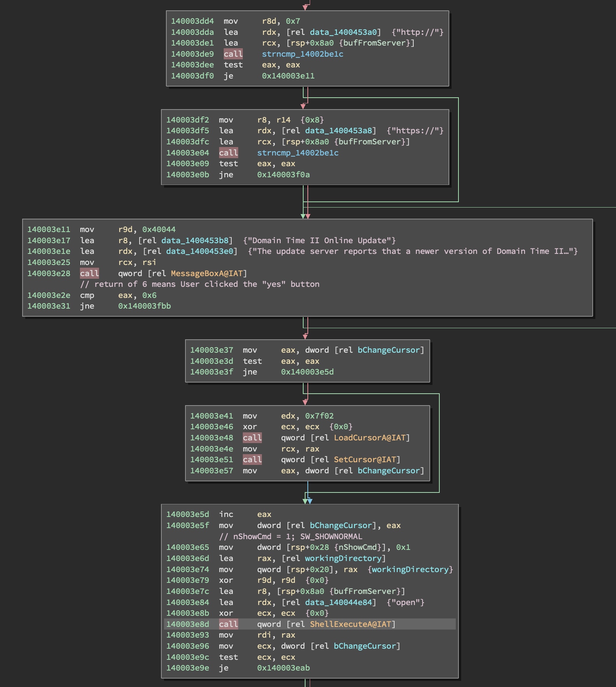
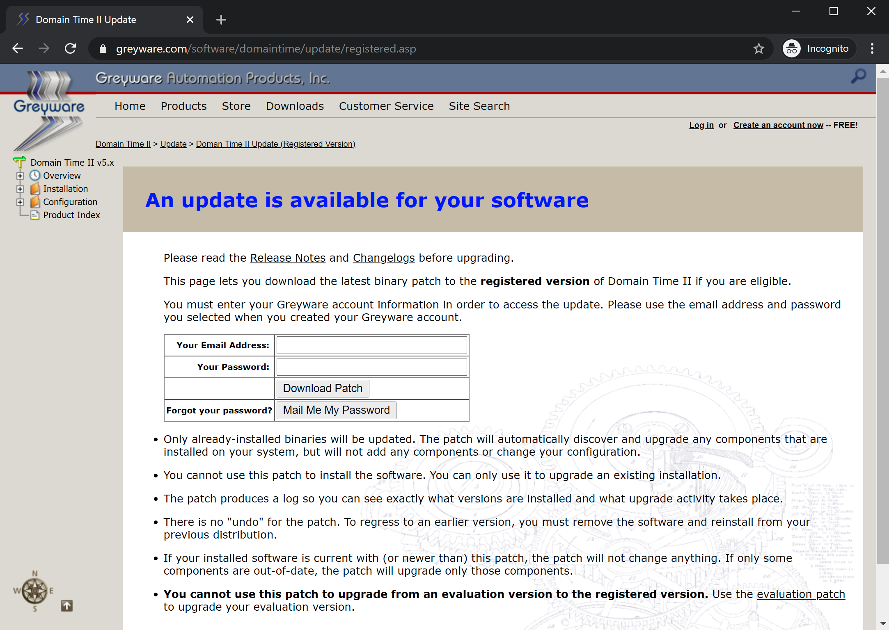
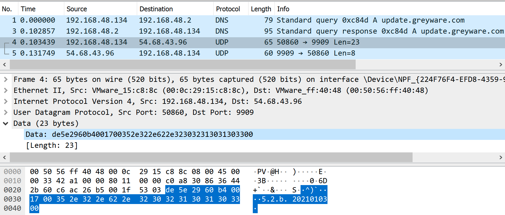
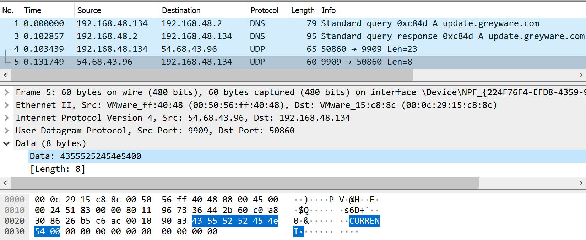
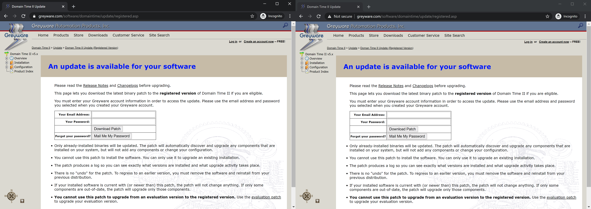

# Overview

Domain Time II is a widely-used network time synchronization solution.
The built-in update mechanism is vulnerable to hijacking which can lead
to Remote Code Execution (RCE) with the same amount of user interaction
as is required for normal updates. The attack demonstration will show
the correct domain in the Uniform Resource Locator (URL) bar, unlike
most phishing attacks which have lookalike domains. Greyware recommends
that Domain Time II be installed on Domain Controllers, which increases
the impact of this vulnerability.

The update mechanism of Domain Time II is an unencrypted version check
via User Datagram Protocol (UDP) to an unauthenticated Internet-facing
Greyware server. This server returns a URL that is automatically opened
by a user’s default browser (e.g.
<https://www.greyware.com/software/domaintime/update/evaluation.asp>).

The lack of authentication between client and server and use of
unencrypted UDP means that an attacker with access to any of the update
traffic could redirect users to a malicious update server; a technique
known as a Man-on-the-Side (MotS) attack.

The legitimate update webpage and download are served over Secure
Hypertext Transfer Protocol (HTTPS). However, the process of prompting a
user to download and execute an executable that applies a patch to get
the update makes it easier to trick users into installing malware posing
as an update. This is particularly dangerous, since it is “highly
recommended” that this software be installed on all domain controllers
within your network.

# Bug Identification

## Domain Time II Upgrade Attack

-   Vulnerability Type: Unauthenticated Upgrade Process

-   Location: dttray.exe

-   Affected Versions: Domain Time II versions 5.2.x (up to, but not
    including, 5.2.b.20210331), 5.1.x (starting from 2010), and 4.1.x
    (starting from 2007) from 5.2.b.20210103 to at least 4.1.b.20070308

-   Impact: Potential Download and Execution of Malicious Payloads

-   CVE Number: TBD

The Domain Time II Client and Server programs both use the same
executable, `dttray.exe`, to check for updates. Neither program
automatically checks for updates by default, but both can be set to
check for updates on startup or can be instructed to check for an update
manually. Additionally, the Domain Time II Update Server component, if
installed, does automatically check for updates whenever the Domain Time
II Manager is opened.

<figure>
<figcaption aria-hidden="true">Disassembly of client processing upgrade response</figcaption>
</figure>

In all update cases, `dttray.exe` will send a UDP query to the update
server to see if an update is available. If the server responds with a
URL (i.e. it begins with “http://” or “https://”), the software will
open a dialog box notifying a user that an update is available. If the
user accepts the dialog, the software calls `ShellExecuteA` with the
"open" argument on the URL returned by the server. This causes a browser
window to open and navigate to the provided URL of the update webpage,
which instructs the user to download and apply an update patch
executable. The disassembly for this process can be seen in Figure
<a href="#fig:disassm" data-reference-type="ref" data-reference="fig:disassm">1</a>,
and the web page displayed to registered users can be seen in Figure
<a href="#fig:update" data-reference-type="ref" data-reference="fig:update">2</a>.
The web page for evaluation software users is similar except it doesn’t
ask for email and password information.

If an attacker is able to intercept the initial UDP query and send back
their own URL, then the user in the above scenario would be prompted to
download and execute an attacker-controlled payload. Any executable
downloaded and run in this way would execute with user privileges,
though it could request elevation of privileges the same way the
legitimate installer does.

<figure>
<figcaption aria-hidden="true">Greyware’s update webpage</figcaption>
</figure>

# Technical Analysis

Observing the weakness in the update protocol is straightforward. By
viewing the traffic generated during the update check in a tool like
Wireshark, we can see two UDP packets originating from the user
software: one Domain Name System (DNS) query, and one packet sent to the
IP resolved from the DNS query to UDP port 9909.

<figure>
<figcaption aria-hidden="true">Client upgrade request packet contents</figcaption>
</figure>

The upgrade request packet contains the client’s version string in ASCII
in plaintext as shown in Figure
<a href="#fig:clientreq" data-reference-type="ref" data-reference="fig:clientreq">3</a>.

<figure>
<figcaption aria-hidden="true">Update server response to up-to-date clients</figcaption>
</figure>

Figure
<a href="#fig:serverresp" data-reference-type="ref" data-reference="fig:serverresp">4</a>
shows a normal response from the update server contains only the
plaintext phrase “CURRENT”, demonstrating there was no encryption or
authentication used.

## Exploit

In order to demonstrate the weakness in this process, the provided
script, `upgrade_attack.py`, listens on the provided network interface
for upgrade traffic and responds to the appropriate DNS and Domain Time
II requests. Additionally, the Proof of Concept (PoC) has an Hypertext
Transfer Protocol (HTTP) impersonation mode (see `--help`). In this
mode, the PoC will respond to HTTP requests as well, and direct users to
a look-alike web server with the correct URL but over HTTP instead of
HTTPS. When run outside of the HTTP impersonation mode, the PoC will
send users directly to the IP of the web server. The script’s
functionality can be summarized in how it deals with each of these three
protocols:

1.  Listens for and responds to DNS requests for update.greyware.com

2.  Listens for and responds to unencrypted Domain Time II version check
    packets, providing a URL that the target will open via HTTP

3.  Serves a lookalike update webpage over HTTP as well as a
    demonstration executable for users to download and run

The result is an attack that mirrors the appearance of the legitimate
update mechanism in order to increase its believability (see Figure
<a href="#fig:comparison" data-reference-type="ref" data-reference="fig:comparison">5</a>).

<figure>
<figcaption aria-hidden="true">Greyware’s official update website (left) and the demonstration attack website (right)</figcaption>
</figure>

The PoC itself was tested and verified to work against versions
`4.1.b.20070308`, `5.1.b.20100731`, and `5.2.b.20210103` of Domain Time
II.

## Testing

To test the provided PoC, the easiest setup is to create a 64-bit
Windows 10 Virtual Machine (VM) and install the evaluation version of
Domain Time II (available here:
<https://www.greyware.com/software/domaintime/>). Since both the client
and server are vulnerable, you can choose to install either one. To
simplify the setup, set the network adapter of the VM to NAT.

Once installed, return to your host and run the `upgrade_attack.py`
script. You will need to provide the IP of your host (as visible to the
client VM) and the name of the interface shared between the host and the
guest VM. In our demonstration using VMWare, this is “vmnet8”.

      python3 upgrade_attack.py vmnet8 XXX.XXX.XXX.XXX

Depending on your host configuration, you may need to run this script
with root privileges. Once the script starts sniffing the specified
interface for the target DNS request, trigger the update process from
within the guest VM. In the Windows system tray (bottom right of the
screen), right click the `dttray.exe` icon, select “Setup” then “Check
for newer version now...” This will trigger the update process and start
the MotS race. If the attack server wins the race, the following
messages will appear in the console output of `upgrade_attack.py`:

      DNS Query for "update.greyware.com." from <Guest VM IP>
      [+] Target DNS Query responded to with <Host IP>
      DNS Response for "update.greyware.com." from <Attack Server>
      DT2 from <Guest VM IP>:60605 to <Host IP>:9909
      [+] Responded to target DT2 Update request: <Payload>
      DT2 from <Host IP>:9909 to <Guest VM IP>:60605

These messages indicate that the attack server sniffed the DNS request
for the legitimate upgrade server, responded with its own IP, then
responded to the upgrade request with its own payload. In this case, the
payload is a fake website that mimics a legitimate Greyware Automation
Products page. At the bottom of the page is a link to “Get the patch!”
Clicking this link prompts the user to download a payload (`calc.exe`)
and execute it as the current user.

We’ve chosen opening the calculator application as an easily-observed
payload action, but the attack server is set up to transparently serve
the attacker’s chosen executable while showing the user the executable name
they requested (typically `dtpatch.exe`). The included demonstration
payload illustrates what warnings the user would experience in an attack
that isn’t trying to evade antivirus, but for testing purposes the
payload could be replaced with Microsoft’s signed `calc.exe` or a
penetration testing tool. Such testing will show the impact in payload
choice on what the victim would see.

Since the MotS vulnerability exploited by this PoC is a race (between
the attack server and the legitimate DNS server), the PoC is not
guaranteed to succeed every time. Additionally, the use of the HTTP
impersonation mode introduces a second race that must be won for the PoC
to be successful. If an attacker can achieve a Man-in-the-Middle (MitM)
scenario on the traffic, they can ensure they always win the race by
blocking either traffic to/from the Internet side. For testing purposes,
we recommend simulating that scenario by disabling your host’s access to
the internet and not running in HTTP impersonation mode.

# Timeline

-   03/30/2021 - Notified vendor

-   03/31/2021 - New version of software released with patch (5.2.b.20210331)

-   04/06/2021 - NotQuite0DayFriday release

-   04/06/2021 - Blog post release
