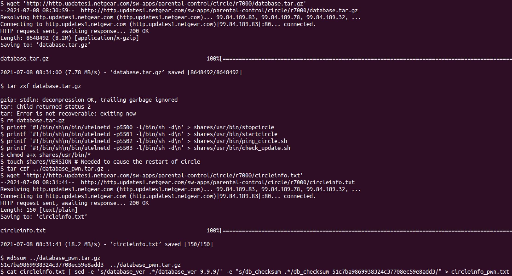
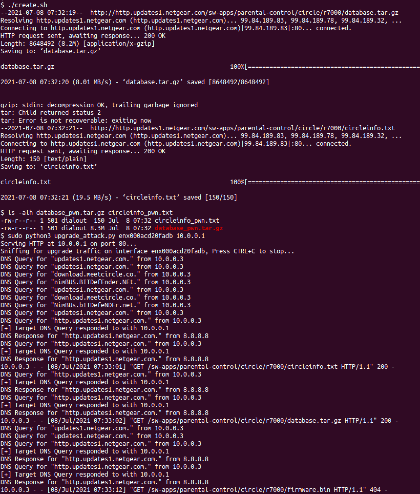

# Overview

The Circle Parental Control Service included in the firmware of several
Netgear routers relies on an insecure update process that is vulnerable
to Man-in-the-Middle (MitM) attacks. Attackers who can perform a MitM
attack (DNS injection, ARP spoofing, etc) on the router’s WAN network
traffic can exploit this vulnerability resulting in Remote Code
Execution (RCE) as root on the router. GRIMM researchers were able to
successfully exploit this vulnerability on a fully patched Netgear
router; the full list of vulnerable devices is available below. Since
the update process is set to run by default, this vulnerability even
affects routers that are not configured to use parental control
features.

The routers impacted by this vulnerability are Small Offices/Home
Offices (SOHO) devices. These devices aren’t frequently found inside
enterprise networks, and thus security issues within them may be
overlooked. However, with the increase in remote work due to Covid-19
precautions, many organizations now have a greater number of their
employees connecting to internal networks through their own, personal
SOHO devices. In these cases, SOHO device vulnerabilities provide a
potential vector through which remote attackers can gain access to the
data sent in and out of corporate networks. Alternatively, attackers may
use this vulnerability in an exploit chain, to compromise any computers
connected to a vulnerable router. For instance, an attacker could
utilize this vulnerability to gain a foothold in the router, and then
exploit any connected computers via a remote vulnerability on the
computers’ Operating System, such as the recent PrintNightmare
vulnerability.[^1]

Ensuring the integrity of employee-owned devices that are used to
connect to corporate networks is a difficult task. However, a Virtual
Private Network (VPN), if configured to handle all traffic that passes
through it, on remote employee devices can protect the integrity of
corporate data even when passed through a compromised router.

# Bug identification

## Circle Parental Control Service insecure update process

-   Vulnerability Type: RCE

-   Location: `/bin/circled` daemon

-   Affected Devices and Versions: The below devices and versions have
    been determined to be vulnerable to this issue. Additionally, GRIMM
    analyzed the first firmware image for the R7000 with Circle support,
    version 1.0.9.10 released in 2017, and found that it also contains
    this vulnerability. As such, older versions of the below devices are
    also likely vulnerable.

    -   R6400v2 - 1.0.4.106

    -   R6700 - 1.0.2.16

    -   R6700v3 - 1.0.4.106

    -   R6900 - 1.0.2.16

    -   R6900P - 1.3.2.134

    -   R7000 - 1.0.11.123

    -   R7000P - 1.3.2.134

    -   R7850 - 1.0.5.68

    -   R7900 - 1.0.4.38

    -   R8000 - 1.0.4.68

    -   RS400 - 1.5.0.68

-   Impact: RCE as root on the device

-   CVE Number: CVE-2021-40847

The update process of the Circle Parental Control Service on various
Netgear routers allows remote attackers with network access to gain RCE
as root via a MitM attack. While the parental controls themselves are
not enabled by default on the routers, the Circle update daemon,
`circled`, is enabled by default. This daemon connects to Circle and
Netgear to obtain version information and updates to the `circled`
daemon and its filtering database. However, database updates from
Netgear are unsigned and downloaded via Hypertext Transfer Protocol
(HTTP). As such, an attacker with the ability to perform a MitM attack
on the device can respond to `circled` update requests with a
specially-crafted, compressed database file, the extraction of which
gives the attacker the ability to overwrite executable files with
attacker-controlled code.

# Technical analysis

The RCE vulnerability exists in the `circled` update daemon and can be
exploited by a remote attacker that is able to sniff and send network
traffic to and from the router. The `circled` daemon polls
`http://http.updates1.netgear.com/sw-apps/parental-control/circle/r7000/circleinfo.txt`
to obtain version information for Circle. This file contains versions,
checksums, and sizes for the firmware, database, and platform
components:

    firmware_ver 2.3.0.1
    database_ver 3.2.1
    platforms_ver 2.15.2
    db_checksum db06d2cb17ce67e7081fd3951b55c5cf
    firmware_size 1982549
    database_size 8648492

Next, `circled` compares the current firmware, database, and platform
versions to the ones mentioned in the downloaded `circleinfo.txt`. If
the component is out of date, `circled` requests the update from:

-   database -
    `http://http.updates1.netgear.com/sw-apps/parental-control/circle/r7000/database.tar.gz`

-   firmware -
    `http://http.updates1.netgear.com/sw-apps/parental-control/circle/r7000/firmware.bin`

-   platform -
    `http://http.updates1.netgear.com/sw-apps/parental-control/circle/r7000/platforms.bin`

Unlike the firmware and platform binaries, which are encrypted and
signed blobs, the database is simply a tarball. Presumably, the database
updates were not protected in a similar manner, as they do not contain
executables, only the Circle filtering database. However, as explained
in the next section, a malicious database update can lead to arbitrary
code execution.

After downloading the updates to the `/tmp` directory, `circled` unpacks
them:

    ## database - The database update is extracted with the command:
    cd /mnt/ && tar xzf /tmp/database.tar.gz

    ## firmware - First firmware.bin is decrypted, signature validated, and copied
    ## to /tmp/sdfiles.tar.gz. Then it's extracted with:
    cd /mnt/ && tar zxf /tmp/sdfiles.tar.gz

    ## platform - First platforms.bin is decrypted, signature validated, and copied
    ## to /tmp/platforms.tgz. Then it's extracted with:
    cd /tmp/ && tar zxf /tmp/platforms.tgz
    [ -s /tmp/platforms/circle-customized.txt ]
    mv -f /tmp/platforms/circle-customized.txt /mnt/shares/usr/bin/
    [ -s /tmp/platforms/platforms.xml ]
    mv -f /tmp/platforms/platforms.xml /tmp/platforms/platforms.ver /mnt/shares/usr/bin/

Once the files are extracted, the `circled` daemon will restart Circle
if it is enabled and currently running. This restart is done via the
`stopcircle` and `startcircle` scripts from the `/mnt/shares/usr/bin/`
directory. Since the database updates are extracted to the same folder
as the firmware binaries, , they can overwrite the `startcircle` and
`stopcircle` scripts with arbitrary code. Additionally, the
`ping_circle.sh` and `check_update.sh` scripts within the same directory
are run once an hour to ping the Circle servers and determine whether
enough time has elapsed between the last update check. These scripts are
executed regardless of whether Circle is enabled, and thus can be used
to obtain code execution regardless of Circle’s status on the device.

## Exploit

This vulnerability can be exploited by serving a malicious database
update to `circled`. This process is demonstrated in the included Proof
of Concept (PoC). For reference, the PoC was developed for and tested
against the Netgear R7000. A fake Domain Name System (DNS) server is run
and configured to respond to requests from the router with the IP
address of a MitM server. If the router receives the malicious DNS
response before the legitimate one, the router will connect to the MitM
server instead of Netgear’s update server. While the PoC uses a DNS
spoofing attack, any type of MitM attack could also exploit this
vulnerability.

The first step is to craft the database update that is used to trigger
remote code execution. To generate a functional database update, GRIMM
downloaded and modified a legitimate Netgear database update. For the
PoC, the database file was modified to overwrite the executable scripts
with code to start telnet on the device on ports 5500-5003 (see Figure
<a href="#fig:create" data-reference-type="ref" data-reference="fig:create">1</a>).
The included `create.sh` can be used to automate this process.

<figure>
<figcaption aria-hidden="true">Creating the Malicious Circle Database</figcaption>
</figure>

The MitM server can be started by executing the included
`upgrade_attack.py` script. This script will listen for DNS requests for
`http.updates1.netgear.com` and respond with the local computer’s IP
address. Additionally, it will host an HTTP server that will respond to
the device’s requests for the database tarball and `circleinfo.txt`
file. During the next circle update, the PoC will serve the malicious
update. The router will then extract the update, which will overwrite
`ping_circle.sh` with code to start telnet on port 5502 on the router.
After an hour, `ping_circle.sh` will be run as root, executing the
injected code which creates the telnet connections necessary for
establishing a bi-directional remote shell. If the router has Circle
enabled, then either `stopcircle` or `startcircle` could be overwritten
instead of `ping_circle.sh`, which would result in the injected code
being run immediately.

## Old Tar

As an aside, the R7000’s tar utility is from
[busybox](https://busybox.net/) version 1.7.2, originally released in
September 2007. One of the issues with old versions of tar is that they
do not safely account for files included in tarballs with absolute
paths. For instance, if a tarball includes a file with a path of
`/tmp/test`, older versions of tar will extract the file to `/tmp/`,
regardless of the current directory. More modern versions will strip the
leading / from the path unless the -P option is specified. As a result,
the Circle database updates can write a file to any directory, not just
those under the `/mnt/` directory. Thus, even if the database update
extraction was restricted to a directory separate from the Circle
executables, it could still compromise the device.

Figure
<a href="#fig:oldtar" data-reference-type="ref" data-reference="fig:oldtar">2</a>
demonstrates this issue by creating a tarball with an absolute path on a
computer with a modern version of tar, copying it to the R7000, and then
extracting the tarball from within the `/mnt/` directory.

<figure>
<figcaption aria-hidden="true">Creating a tarball with an absolute path</figcaption>
</figure>

## Testing

A shell script, `create.sh`, has been provided to create a malicious
database tarball and the associated `circleinfo.txt` file for the R7000.
Once generated, these files will need to be served via a MitM attack on
the device. The easiest way to test the MitM attack is via DNS spoofing.
From a computer on the WAN side of the device, run the include
`upgrade_attack.py` script. You will need to provide the IP address of
the host (as visible to the device) and the name of the interface
between the host and the device. Once the script is running, the next
Circle update occurs, the script will spoof the response for
`http.updates1.netgear.com` to return the local computer’s IP address.
It will then serve the malicious database tarball and `circleinfo.txt`
files created by `create.sh`. Afterwards, the device will start a telnet
instance on ports 5500-5503 immediately if Circle is enabled, or within
the hour if it’s disabled.
Figure <a href="#fig:poc" data-reference-type="ref" data-reference="fig:poc">3</a>
illustrates this process.

<figure>
<figcaption aria-hidden="true">The PoC exploiting the Circle update on the R7000</figcaption>
</figure>

## Affected Devices

The Netgear devices listed below (followed by the most recent version of
of the firmware available when this research was conducted) have been
verified to contain the vulnerable update code.

-   R6400v2 - 1.0.4.106

-   R6700 - 1.0.2.16

-   R6700v3 - 1.0.4.106

-   R6900 - 1.0.2.16

-   R6900P - 1.3.2.134

-   R7000 - 1.0.11.123

-   R7000P - 1.3.2.134

-   R7850 - 1.0.5.68

-   R7900 - 1.0.4.38

-   R8000 - 1.0.4.68

-   RS400 - 1.5.0.68

# Timeline

-   07/23/2021 - First attempt to notify vendor

-   07/29/2021 - Second attempt to notify vendor

-   07/30/2021 - Third attempt to notify vendor

-   08/09/2021 - Notified CISA

-   08/18/2021 - Met with Netgear product security team

-   08/18/2021 - Granted two-week extension to release deadline

-   09/09/2021 - Assigned CVE-2021-40847

-   09/20/2021 - Security advisory released by vendor

-   09/21/2021 - Patches made available by vendor

-   09/21/2021 - NotQuite0DayFriday release

-   09/21/2021 - Blog post release

[^1]: <https://us-cert.cisa.gov/ncas/current-activity/2021/06/30/printnightmare-critical-windows-print-spooler-vulnerability>
