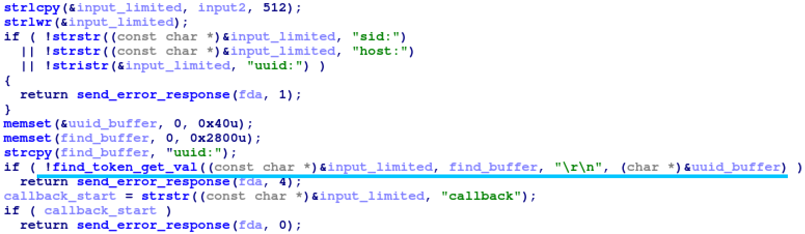
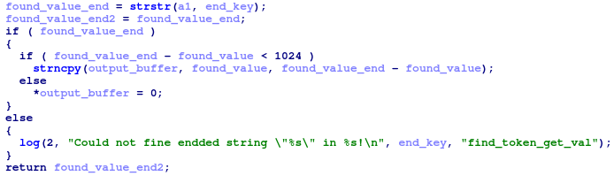
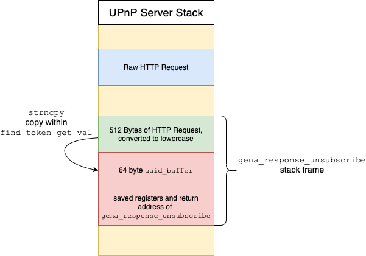
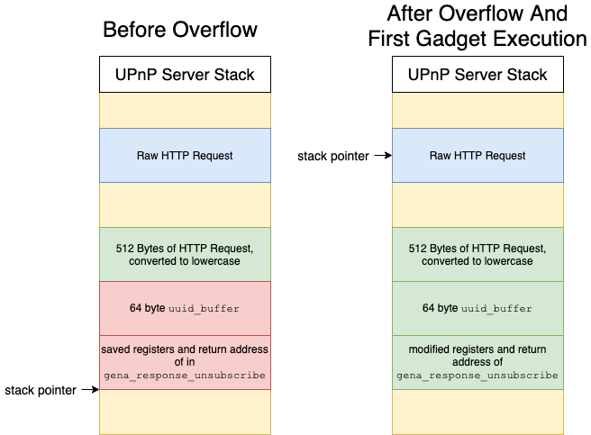
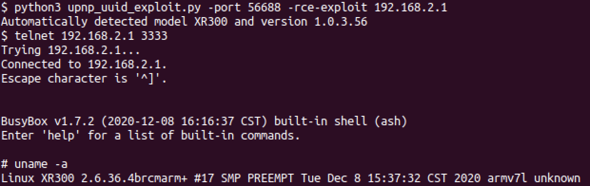
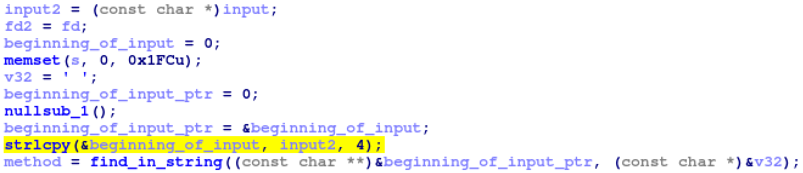
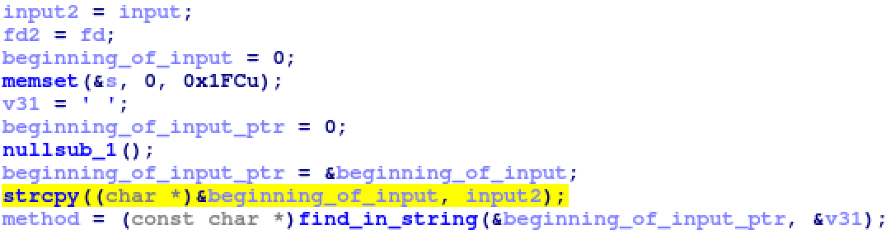
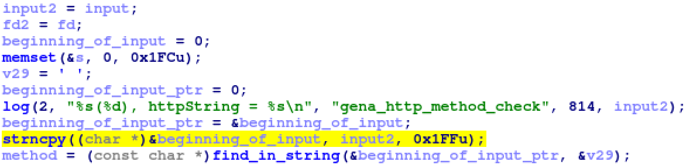

# Overview

Netgear SOHO Devices contain a vulnerability that allows an attacker
within the device’s Local Area Network (LAN) to obtain Remote Code
Execution (RCE) as root on the device. GRIMM researchers were able to
use the vulnerability to create an exploit that can compromise fully
patched Netgear devices in the default configuration. The full list of
vulnerable devices is available below.

Small Offices/Home Offices (SOHO) routers, modems, and WiFi range
extenders are among the devices affected by this vulnerability. These
devices aren’t frequently found inside enterprise networks, and thus
security issues within them may be overlooked. However, with the
increase in remote work due to COVID-19 precautions, many organizations
now have a greater number of their employees connecting to internal
networks through their own, personal SOHO devices. In these cases, SOHO
device vulnerabilities provide a potential vector through which remote
attackers can gain access to the data sent in and out of corporate
networks. Alternatively, attackers may use these vulnerabilities in an
exploit chain, to compromise any computers connected to a vulnerable
device. For instance, an attacker could utilize these vulnerabilities to
gain a foothold in the device, and then exploit any connected computers
via a separate remote vulnerability on the computers’ Operating System
(OS).

Ensuring the integrity of employee-owned devices that are used to
connect to corporate networks is a difficult task. However, a Virtual
Private Network (VPN), if configured to handle all traffic that passes
through it, on remote employee devices can protect the integrity of
corporate data even when passed through a compromised device.

# Bug identification

## Netgear SOHO Devices upnpd Service Pre-Authentication Stack Overflow [uuidOverflow]

-   Vulnerability Type: Pre-Authentication Stack Overflow

-   Location: `gena_response_unsubscribe` function in the `upnpd` daemon

-   Affected devices and versions listed in
    Table <a href="#table:uuid_devs" data-reference-type="ref" data-reference="table:uuid_devs">1</a>

-   Fixed versions: see Netgear [security
    bulletin](https://kb.netgear.com/000064361/Security-Advisory-for-Pre-Authentication-Buffer-Overflow-on-Multiple-Products-PSV-2021-0168)

-   Impact: RCE as root on the device by an unauthenticated attacker on
    the device’s LAN.

<div id="table:uuid_devs" markdown="1">

| **Vulnerable Devices** |                       |                        |
|:-----------------------|:----------------------|:-----------------------|
| AC1450 - 1.0.0.36      | D6220 - 1.0.0.72      | D6300 - 1.0.0.102      |
| D6400 - 1.0.0.104      | D7000v2 - 1.0.0.66    | D8500 - 1.0.3.60       |
| DC112A - 1.0.0.56      | DGN2200v4 - 1.0.0.116 | DGN2200M - 1.0.0.35    |
| DGND3700v1 - 1.0.0.17  | EX3700 - 1.0.0.88     | EX3800 - 1.0.0.88      |
| EX3920 - 1.0.0.88      | EX6000 - 1.0.0.44     | EX6100 - 1.0.2.28      |
| EX6120 - 1.0.0.54      | EX6130 - 1.0.0.40     | EX6150 - 1.0.0.46      |
| EX6920 - 1.0.0.54      | EX7000 - 1.0.1.94     | MVBR1210C - 1.2.0.35BM |
| R4500 - 1.0.0.4        | R6200 - 1.0.1.58      | R6200v2 - 1.0.3.12     |
| R6250 - 1.0.4.48       | R6300 - 1.0.2.80      | R6300v2 - 1.0.4.52     |
| R6400 - 1.0.1.72       | R6400v2 - 1.0.4.106   | R6700 - 1.0.2.16       |
| R6700v3 - 1.0.4.118    | R6900 - 1.0.2.16      | R6900P - 1.3.2.134     |
| R7000 - 1.0.11.123     | R7000P - 1.3.2.134    | R7300DST - 1.0.0.74    |
| R7850 - 1.0.5.68       | R7900 - 1.0.4.38      | R8000 - 1.0.4.68       |
| R8300 - 1.0.2.144      | R8500 - 1.0.2.136     | RS400 - 1.5.0.68       |
| WGR614v9 - 1.2.32      | WGT624v4 - 2.0.13     | WNDR3300v1 - 1.0.45    |
| WNDR3300v2 - 1.0.0.26  | WNDR3400v1 - 1.0.0.52 | WNDR3400v2 - 1.0.0.54  |
| WNDR3400v3 - 1.0.1.38  | WNDR3700v3 - 1.0.0.42 | WNDR4000 - 1.0.2.10    |
| WNDR4500 - 1.0.1.46    | WNDR4500v2 - 1.0.0.72 | WNR834Bv2 - 2.1.13     |
| WNR1000v3 - 1.0.2.78   | WNR2000v2 - 1.2.0.12  | WNR3500 - 1.0.36NA     |
| WNR3500v2 - 1.2.2.28NA | WNR3500L - 1.2.2.48NA | WNR3500Lv2 - 1.2.0.66  |
| XR300 - 1.0.3.56       |                       |                        |

Devices and Versions vulnerable to the stack overflow in
`gena_response_unsubscribe` in the `upnpd` daemon

</div>

These devices are vulnerable, but the vulnerable feature within `upnpd`
has been broken by a previous vulnerability mitigation, and thus they
cannot be exploited. See the Broken Functionality section below for more
information.

The `upnpd` daemon accepts unauthenticated HTTP SUBSCRIBE and
UNSUBSCRIBE requests from clients that wish to receive updates whenever
the network’s UPnP configuration changes. The
`gena_response_unsubscribe` function handles the UNSUBSCRIBE requests.
This function (shown in
Figure <a href="#fig:unsubscribe" data-reference-type="ref" data-reference="fig:unsubscribe">1</a>)
copies 512 bytes of the HTTP request to a local stack buffer, converts
it to lowercase (via `strlwr`), and then validates that it contains the
strings `sid:`, `host:`, and `uuid:`. Afterwards, it calls
`find_token_get_val` function to parse the UUID header (i.e. get the
value between the strings `uuid:` and `\r``\n`). The
`find_token_get_val` function’s 4th argument is used to return the
parsed value to the caller; `find_token_get_val` will copy the parsed
value of at most 1024 characters to this argument (as shown in
Figure <a href="#fig:strncpy" data-reference-type="ref" data-reference="fig:strncpy">2</a>).
However, the `uuid_buffer` stack buffer passed to this function from
`gena_response_unsubscribe` is only 64 bytes. As such, an attacker can
overflow this stack buffer and control the saved registers and return
address on the stack. The stack layout during the overflow is depicted
in
Figure <a href="#fig:stack" data-reference-type="ref" data-reference="fig:stack">3</a>.

<figure>
<figcaption aria-hidden="true">Figure 1: Pre-Authentication Stack Overflow in <code>gena_response_unsubscribe</code></figcaption>
</figure>

<figure>
<figcaption aria-hidden="true">Figure 2: <code>strncpy</code> With Assumed 1024 Length in <code>find_token_get_val</code></figcaption>
</figure>

<figure>
<figcaption aria-hidden="true">Figure 3: Stack Layout During the Stack Overflow</figcaption>
</figure>

# Technical analysis

This section describes a Proof of Concept (PoC) exploit developed for
the vulnerability that can reset the administrator password or execute
arbitrary commands on a vulnerable device.

## UUID Exploit [exploit2]

This stack overflow is a traditional stack overflow that is not
protected by any modern vulnerability mitigations. However, exploitation
of this stack overflow is complicated by a few factors:

1.  Prior to overflowing the stack, the buffer with the user’s input is
    converted to lowercase. As a result, the exploit cannot use any
    gadgets which contain bytes with capital letters (ASCII 0x41-0x5A).

2.  The copy which overflows the stack is a string copy. As such, it
    will stop copying characters if it encounters a `NULL` character.
    Thus, the exploit cannot include gadgets with `NULL` bytes.

While the first limitation can be easily avoided by carefully choosing
gadgets, the second limitation is much more difficult to bypass. All of
the addresses within the `upnpd` daemon contain a `NULL` character as
the Most Significant Byte (MSB). Further, the exploit cannot specify a
library address either. While the main `upnpd` executable does not
support Address Space Layout Randomization (ASLR), the Linux kernel will
automatically randomize the address of any loaded libraries. Thus, the
exploit cannot know where the libraries are loaded. Instead, the PoC
bypasses this limitation by omitting the gadget’s MSB in the payload,
and then immediately ending the payload. The string copy which overflows
the stack will automatically `NULL` terminate the string, and thus write
a single `NULL` byte for us. However, this technique has the
disadvantage that it can only write a single NULL byte at the end of the
payload. As such, the exploit can only run a single gadget via this
technique.

The PoC implements two separate techniques for converting the execution
of a single gadget into a useful effect. The first technique simply
jumps to the code shown below, which resets the web server password to
the string `password`. The second technique jumps to a gadget which adds
0x1000 to the stack, and then continues loading gadgets. This gadget
skips several stack frames to find the raw HTTP request received by the
`upnpd` daemon. The raw HTTP request is not limited in the characters it
can contain, and has not been modified from the value initially
received. By loading addresses from the raw HTTP request, the PoC can
include gadgets with `NULL` and upper case characters. This process is
illustrated in
Figure <a href="#fig:overflow" data-reference-type="ref" data-reference="fig:overflow">4</a>.
With the ability to call arbitrary gadgets, the PoC can now call a
`system` gadget to run a custom command. As the `upnpd` daemon’s machine
code does not always contain a `system` gadget with the command on the
stack, the PoC first stores the command to run in a global variable, and
then references that variable when calling a non-stack based `system`
gadget.

<figure>
<figcaption aria-hidden="true">Figure 4: Stack Pointer Redirection</figcaption>
</figure>

``` objectivec
acosNvramConfig_set("http_passwd", "password");
```

### Testing

A Python script, `upnp_uuid_exploit.py` has been provided that will
exploit the UUID vulnerability in the `upnpd` daemon. If not specified,
the exploit will automatically determine the device’s model and version
by querying the device’s web server for the `/currentsetting.htm` page.
This page contains the model and version information and is available
without authentication on most Netgear devices.
Figure <a href="#fig:uuid_poc" data-reference-type="ref" data-reference="fig:uuid_poc">5</a>
demonstrates the PoC against a Netgear XR300 router. By default, the PoC
will reset the web server’s password to `password`. Once the exploit has
finished, the attacker will be able to login to the web server and
modify any settings or launch further attacks on the web server.
Alternatively, the PoC exposes the `-rce-exploit` option which will
cause the PoC to send a RCE payload instead. However, the PoC only
supports RCE payloads for a smaller subset of the affected devices. The
RCE exploit will execute a custom command, which by default will start
the telnet daemon on port 3333.

<figure>
<figcaption aria-hidden="true">Figure 5: The UUID handler stack overflow PoC exploiting the <code>upnpd</code> server on the XR300</figcaption>
</figure>

The PoC has been written for and tested against the list of device and
versions below. Additional devices can be added by analyzing the
firmware images to find the necessary gadgets.

1.  R7000 version 1.0.11.100, 1.0.11.106, and 1.0.11.110

2.  XR300 version 1.0.3.56 and 1.0.3.38

3.  R6700v3 version 1.0.4.118

### Broken Functionality [broken]

In some firmwares, the `handle_subscribe_unsubscribe` function, which
calls the vulnerable `gena_response_unsubscribe` function, contains an
incorrect fix for a previous stack buffer overflow (shown in
Figure <a href="#fig:r7000_uuid" data-reference-type="ref" data-reference="fig:r7000_uuid">6</a>).
This stack overflow occurred when the user input (up to 8191 bytes) is
copied into a 512-byte stack buffer at the beginning of
`handle_subscribe_unsubscribe`. However, beginning in version 1.0.11.116
of the R7000, the `strcpy` was converted to a
`strlcpy(beginning_of_input, all_input, 4)` call. As such, only the
first 3 bytes of the user’s input are copied to the stack buffer
(leaving 1 byte for the terminating `NULL` character). This stack buffer
is then parsed to respond to the request, which obviously cannot be done
with only the first 3 bytes of the request. As a result, all UPnP
SUBSCRIBE and UNSUBSCRIBE requests are broken in the R7000 in version
1.0.11.116 and later. Thus, the vulnerable UUID handling code within
`upnpd` cannot be reached and these firmware images are not vulnerable
to the UUID stack overflow vulnerability. However, once this
functionality is fixed, the vulnerable code will once again be
reachable, and the devices will be exploitable again.

<figure>
<figcaption aria-hidden="true">Figure 6: Broken SUBSCRIBE and UNSUBSCRIBE handling within the R7000 1.0.11.123 firmware</figcaption>
</figure>

While only the developers know the source of this incorrect patch, we
can make an educated guess. As the size of a pointer on the R7000 is
4-bytes (32-bits), it’s likely that the incorrect patch is the result of
the `sizeof` operator incorrectly being applied to a pointer type.[^1]
For instance, consider the strlcpy code in
Listing <a href="#lst:badcopy" data-reference-type="ref" data-reference="lst:badcopy">[lst:badcopy]</a>.
If the `sizeof` operator is passed the `beginning_of_input_ptr` pointer,
rather than the `beginning_of_input` character buffer, it will return a
size of 4.

``` objectivec
char beginning_of_input[0x200];
char *beginning_of_input_ptr = beginning_of_input;
// wrong: beginning_of_input_ptr type is char*, size 4
strlcpy(beginning_of_input_ptr, input, sizeof(beginning_of_input_ptr));
// right: beginning_of_input type is char[0x200], size 0x200
strlcpy(beginning_of_input_ptr, input, sizeof(beginning_of_input));
```

While disabling the SUBSCRIBE and UNSUBSCRIBE request handlers in this
way prevents exploitation of this vulnerability, it also will prevent
legitimate applications from using this functionality. UPnP event
subscriptions are used in home automation systems, such as
SmartThings[^2] and Homebridge,[^3] to detect changes within devices on
their network. Without a working event subscriptions system, they won’t
be able to detect changes within the SOHO device.

Other models within the same codebase, such as the RS400, have not fixed
the original bug, as shown in
Figure <a href="#fig:rs400_uuid" data-reference-type="ref" data-reference="fig:rs400_uuid">7</a>.
However, most models, such as the XR300, have fixed it correctly, as
shown in
Figure <a href="#fig:xr300_uuid" data-reference-type="ref" data-reference="fig:xr300_uuid">8</a>.
In either case, the vulnerable UUID handler is reachable and can be
exploited.

<figure>
<figcaption aria-hidden="true">Figure 7: Unmitigated <code>strcpy</code> within the SUBSCRIBE and UNSUBSCRIBE handler in the RS400 1.5.0.68 firmware</figcaption>
</figure>

<figure>
<figcaption aria-hidden="true">Figure 8: Correct SUBSCRIBE and UNSUBSCRIBE handling within the XR300 1.0.3.56 firmware</figcaption>
</figure>

# Timeline

-   09/16/2021 - Vendor release [security
    advisory](https://kb.netgear.com/000064030/R6700v3-Firmware-Version-1-0-4-120)
    for the R6700v3

-   09/28/2021 - Disclosed additional affected devices to vendor

-   11/09/2021 - Vendor releases [security
    advisory](https://kb.netgear.com/000064361/Security-Advisory-for-Pre-Authentication-Buffer-Overflow-on-Multiple-Products-PSV-2021-0168)
    and patches

-   11/16/2021 - NotQuite0DayFriday release

-   11/16/2021 - Blog release

[^1]: <https://cwe.mitre.org/data/definitions/467.html>

[^2]: <https://www.smartthings.com/>

[^3]: <https://homebridge.io/>
